# NFC-Kasse – Bedieneranleitung

4. Oktober 2026 · Kim Schehl

## 1. Überblick

NFC-Kasse ist ein bargeldloses Kassensystem für Veranstaltungen. Jeder Gast bekommt einen NFC-Chip (Armband oder Karte), auf den an der Bonkasse Guthaben geladen wird. An den Ständen wird der Chip gescannt und der Betrag abgebucht. Ein Windows-Laptop im eigenen Netz ist der Server, kassiert wird auf Tablets, Smartphones oder im Browser. Während der Veranstaltung braucht das System kein Internet.

Diese Anleitung führt Schritt für Schritt durch Installation, Einrichtung, Verkauf und Abrechnung. Für einzelne Aufgaben gibt es eigene Anleitungen:

- [Kurzanleitung Standpersonal](Kurzanleitung_Standpersonal.md): eine Seite für die Leute am Stand. Chip scannen, Artikel antippen, buchen.
- [Zusatzfunktionen Pager und Leaderboard](Zusatzfunktionen_Pager_Leaderboard.md): die beiden Funktionen mit Lizenz.
- [Handbuch für Systemadministratoren](Handbuch_Systemadministratoren.md): Router, feste IP-Adressen, der Name nfc-kasse.lan, Datensicherung und Fehlersuche im Detail.

### Was zum System gehört

| Baustein | Aufgabe | Wo |
| --- | --- | --- |
| Server (NFC-Kasse Backend) | speichert Chips, Guthaben, Artikel und Buchungen | Windows-Dienst auf dem Server-Laptop, meist der Laptop an der Bonkasse |
| NFC-Kasse Verwaltung | Dienst starten und stoppen, Einstellungen, Bon-Layout | Programm auf dem Server-Laptop |
| Kassen-App | kassieren, aufladen, auszahlen, Statistik | Android-Tablets und -Smartphones |
| Weboberfläche | dieselbe Kasse im Browser | `http://nfc-kasse.lan:8000/webapp` |
| NFC-Leser | liest den Chip | Bluetooth-Leser „NFC-Reader\_0001“ usw., eingebautes NFC (Android) oder USB-Leser |
| Bondrucker (optional) | druckt Papierbons für Barverkäufe | im Netzwerk (empfohlen) oder per Kabel am Server |
| Router mit WLAN | verbindet alle Geräte | z. B. GL.iNet |

### Was Sie brauchen

- Einen Windows-Laptop oder -PC (64 Bit) als Server. Für die Installation brauchen Sie Administratorrechte.
- Einen eigenen Router mit WLAN, in dem Server und alle Kassen sind. Wie der Router eingerichtet wird, steht im Handbuch für Systemadministratoren.
- Android-Tablets oder -Smartphones als Kassen. Für die Weboberfläche mit Bluetooth-Leser: Google Chrome oder Microsoft Edge.

### Adressen in dieser Anleitung

Die Anleitung geht von der Standard-Einrichtung aus. Der Server ist unter `http://nfc-kasse.lan:8000` erreichbar. Kennt Ihr Netz diesen Namen nicht, nehmen Sie überall stattdessen `http://192.168.1.2:8000`. Diese Adresse hat der Server-Laptop, wenn der Router nach dem Handbuch für Systemadministratoren eingerichtet ist.

## 2. Installation

Die Installation machen Sie einmal auf dem Server-Laptop. Danach läuft NFC-Kasse als Windows-Dienst: Er startet mit Windows von selbst und wird nach einem Absturz automatisch neu gestartet. Für den Download brauchen Sie einmal Internet, für den Betrieb nicht mehr.

### 2.1 Setup herunterladen

1. Am Server-Laptop im Browser **https://nfc-kasse.de/download** öffnen.
2. **NFC-Kasse-Setup.exe** herunterladen. Fragt der Browser, ob die Datei behalten werden soll, bestätigen Sie mit **Behalten**.

### 2.2 Installieren

1. Im Ordner **Downloads** doppelt auf **NFC-Kasse-Setup.exe** klicken.
2. Zeigt Windows „Der Computer wurde durch Windows geschützt“: auf **Weitere Informationen** und dann auf **Trotzdem ausführen** klicken. Die Meldung erscheint, weil das Setup nicht signiert ist.
3. Die Frage der Benutzerkontensteuerung mit **Ja** beantworten.
4. Seite **Installationsmodus**: Bei einer Neuinstallation ist **Installieren** vorgewählt. Auf **Weiter** klicken.
5. Zielordner `C:\Program Files\NFC-Kasse` so lassen, **Weiter**.
6. **Desktop-Symbol erstellen** ankreuzen. Das legt „NFC-Kasse öffnen“ und „NFC-Kasse Verwaltung“ auf den Desktop. **Weiter**.
7. **Installieren** klicken. Das Setup kopiert die Dateien, richtet den Dienst und die Firewall ein und startet den Dienst.
8. Auf der letzten Seite den Haken bei **NFC-Kasse jetzt öffnen** lassen und auf **Fertigstellen** klicken. Der Browser öffnet die Anmeldeseite der Kasse. Zeigt er zunächst einen Fehler, ein paar Sekunden warten und die Seite neu laden.

Weiter geht es mit Abschnitt 4, Erster Start.

### 2.3 Was das Setup einrichtet

- Programm in `C:\Program Files\NFC-Kasse\`, Daten in `C:\ProgramData\NFC-Kasse\` (Datenbank, Einstellungen, Bon-Layout, Protokolle, Sicherungen).
- Den Windows-Dienst **NFC-Kasse Backend**.
- Eine Firewall-Regel, damit Tablets im WLAN den Server erreichen.
- Eine Browser-Einstellung für Edge und Chrome, damit der Bluetooth-Leser in der Weboberfläche auf diesem Laptop funktioniert.
- Im Startmenü den Ordner **NFC-Kasse** mit „NFC-Kasse öffnen“, „NFC-Kasse Verwaltung“, „Dienst starten“ und „Dienst stoppen“.

### 2.4 Prüfen, ob alles läuft

1. **NFC-Kasse Verwaltung** öffnen. Auf dem Dashboard muss „NFC-Kasse Backend: Läuft“ stehen (Abschnitt 3).
2. An einem Tablet im selben WLAN den Browser öffnen und `http://nfc-kasse.lan:8000/webapp` eingeben. Die Anmeldeseite muss erscheinen. Klappt das nur am Laptop selbst, hilft das Handbuch für Systemadministratoren weiter (Router und Firewall).
3. Den Laptop einmal neu starten und prüfen, ob der Dienst danach wieder läuft.

### 2.5 Android-App auf Tablets und Smartphones installieren

Die App kommt vom eigenen Server, nicht aus dem Play Store.

1. An einem Gerät, das schon angemeldet ist, zum Beispiel am Server-Laptop, **Einstellungen → Über** öffnen. Unten steht ein QR-Code.
2. Den QR-Code mit der Kamera des Tablets scannen. Alternativ im Browser des Tablets `http://nfc-kasse.lan:8000/download` eingeben.
3. Auf der Download-Seite **APK herunterladen** tippen.
4. Die Datei in den Downloads öffnen. Fragt Android nach, bei **Aus dieser Quelle erlauben** den Schalter einschalten und zurück.
5. **Installieren** tippen und die App öffnen.

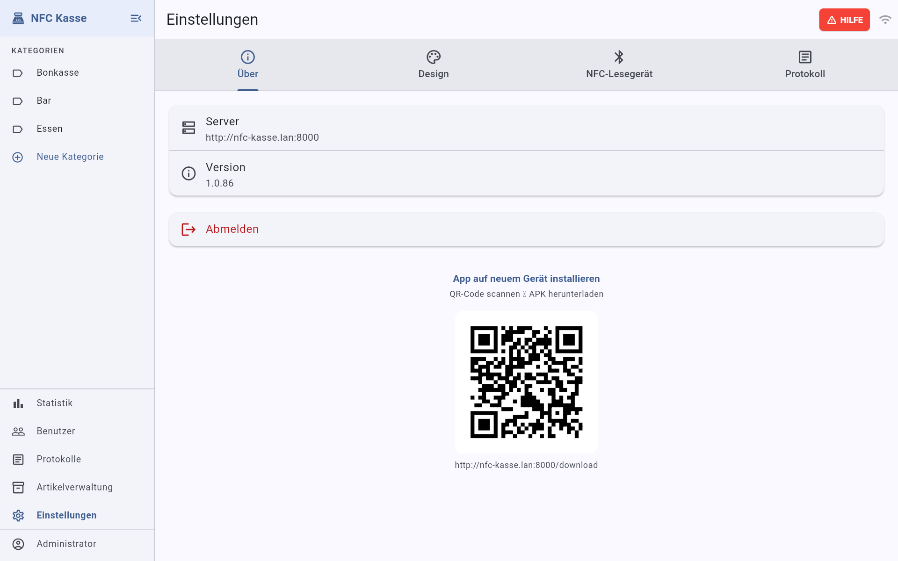

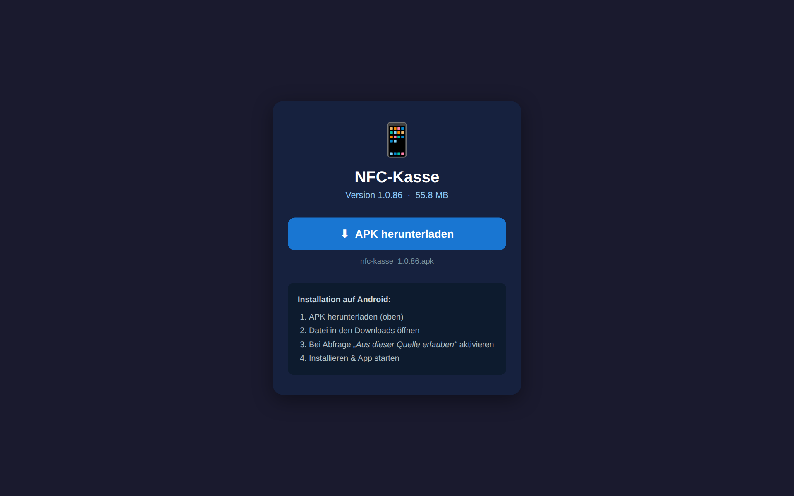

Neue Versionen bietet die App danach selbst an: Sie zeigt **Update verfügbar**, mit **Jetzt aktualisieren** wird die neue Version installiert.

### 2.6 Aktualisieren

1. Die neue **NFC-Kasse-Setup.exe** von https://nfc-kasse.de/download herunterladen.
2. Ausführen. Auf der Seite Installationsmodus ist jetzt **Aktualisieren** vorgewählt.
3. Durchklicken bis **Fertigstellen**. Das Setup stoppt den Dienst, ersetzt das Programm und startet den Dienst wieder.

Datenbank, Einstellungen und Bon-Layout bleiben dabei erhalten. Aktualisieren Sie nicht während des Verkaufs, für kurze Zeit sind keine Buchungen möglich.

### 2.7 Deinstallieren

1. In Windows **Einstellungen → Apps** den Eintrag **NFC-Kasse Backend** deinstallieren. Oder das Setup starten und **Deinstallieren** wählen.
2. Zuerst kommt die Frage „Sollen auch alle gespeicherten Daten gelöscht werden?“. **Nein** ist vorgewählt und behält Datenbank, Einstellungen und Sicherungen für eine spätere Neuinstallation. **Ja** löscht alles endgültig.
3. Die Rückfrage zur Deinstallation bestätigen.

## 3. Das Verwaltungstool

Mit der **NFC-Kasse Verwaltung** steuern Sie den Server am Laptop: Dienst starten und stoppen, Einstellungen ändern, den Bon gestalten. Alles, was mit Artikeln, Benutzern und Verkauf zu tun hat, machen Sie dagegen in der Kasse selbst (ab Abschnitt 4).

### 3.1 Öffnen

1. Auf dem Desktop **NFC-Kasse Verwaltung** doppelklicken, oder im Startmenü unter **NFC-Kasse** wählen.
2. Die Frage der Benutzerkontensteuerung mit **Ja** beantworten.
3. Links sind vier Seiten: **Dashboard**, **Konfiguration**, **Bon-Layout** und **Info**.

### 3.2 Dashboard

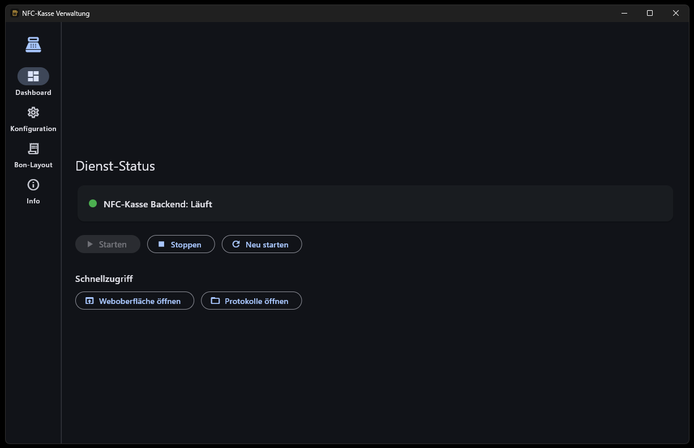

- **Dienst-Status** zeigt mit grünem Punkt „Läuft“ oder „Gestoppt“.
- **Starten**, **Stoppen**, **Neu starten** steuern den Dienst. Ausgegraut ist, was gerade nicht geht.
- **Weboberfläche öffnen** öffnet die Kasse im Browser dieses Laptops.
- **Protokolle öffnen** öffnet den Ordner mit den Protokolldateien. Den brauchen Sie nur bei Problemen.

Während der Dienst neu startet, sind für einige Sekunden keine Buchungen möglich. Die Kassen verbinden sich danach von selbst wieder.

### 3.3 Konfiguration

Hier stehen die Einstellungen des Servers. Ganz unten sind zwei Knöpfe:

- **Speichern & Dienst neu starten** speichert und übernimmt die Änderung sofort. Das ist der Normalfall.
- **Speichern** speichert nur. Die Änderung wirkt erst beim nächsten Neustart, die Verwaltung zeigt dann „Neustart nötig“.

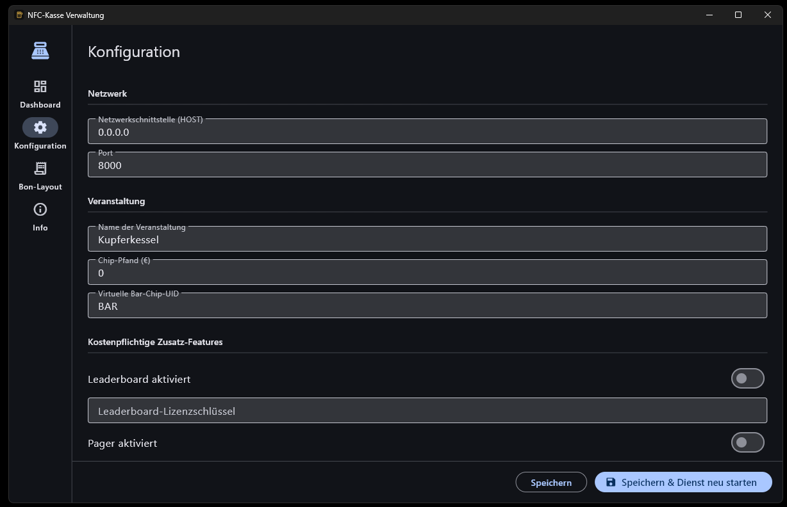

| Feld | Was eintragen |
| --- | --- |
| Netzwerkschnittstelle (HOST) | `0.0.0.0` lassen. Damit ist der Server im ganzen Netz erreichbar. |
| Port | `8000` lassen. Wer ihn ändert, muss alle Adressen in dieser Anleitung anpassen. |
| Name der Veranstaltung | Name, der in der Kasse und auf den Bons steht, z. B. „Weinfest 2026“. |
| Chip-Pfand (€) | Pfand pro Chip, z. B. `3` oder `2.50`. `0` = kein Pfand. Abschnitt 9.3 erklärt, wie der Pfand gebucht wird. |
| Virtuelle Bar-Chip-UID | `BAR` lassen. Auf diesen gedachten Chip werden Barverkäufe mit Papierbon gebucht. |
| Leaderboard aktiviert, Pager aktiviert | Schalter für die Zusatzfunktionen. Sie wirken nur mit dem passenden Lizenzschlüssel darunter. |


| Feld | Was eintragen |
| --- | --- |
| Leaderboard-Lizenzschlüssel, Pager-Lizenzschlüssel | Den Schlüssel aus der Lizenz-Mail einfügen. So bekommen Sie ihn: Abschnitt 3.5. |
| Webapp-Pfad | `/webapp` lassen. |
| Erlaubte Herkunfts-Adressen (CORS) | Empfohlen: `http://localhost:8000,http://127.0.0.1:8000,http://nfc-kasse.lan:8000,http://192.168.1.2:8000`. Dann klappt die Anmeldung im Browser unter beiden Adressen. |
| Protokoll-Level | `INFO` lassen. `DEBUG` nur zur Fehlersuche, das erzeugt sehr viele Einträge. |

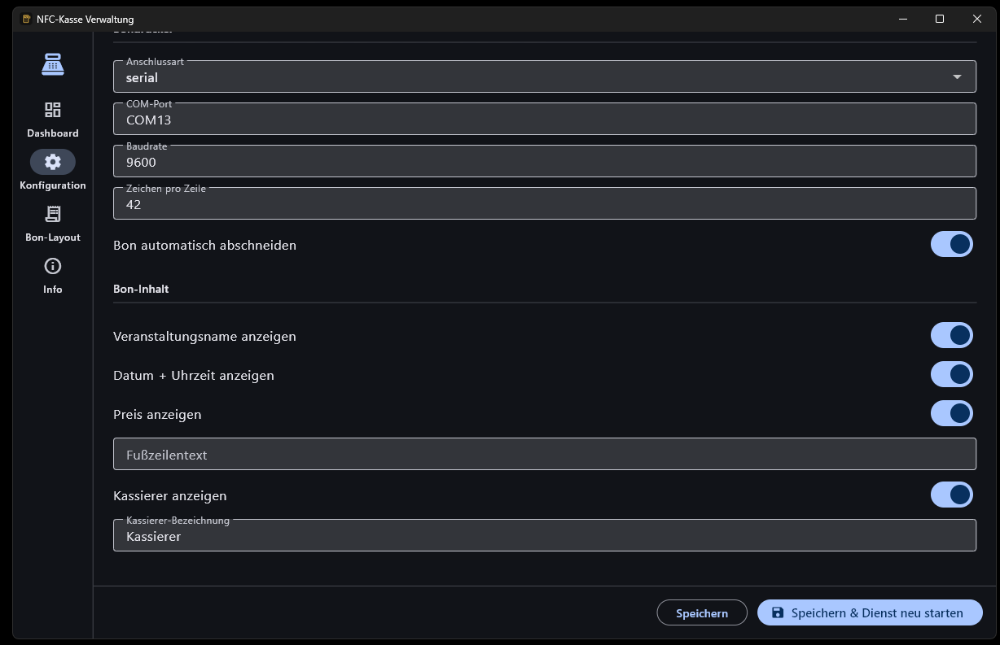

Die Bereiche **Bondrucker** und **Bon-Inhalt** sind in Abschnitt 8 Schritt für Schritt erklärt.

Wichtig beim Ausfüllen: Beträge mit Punkt schreiben, nicht mit Komma (`2.50`, nicht `2,50`). In Zahlenfelder wie Port oder Baudrate gehören nur Ziffern. Ein falscher Wert kann verhindern, dass der Dienst startet. Steht das Dashboard nach dem Speichern auf „Gestoppt“, korrigieren Sie den zuletzt geänderten Wert und speichern erneut.

### 3.4 Bon-Layout

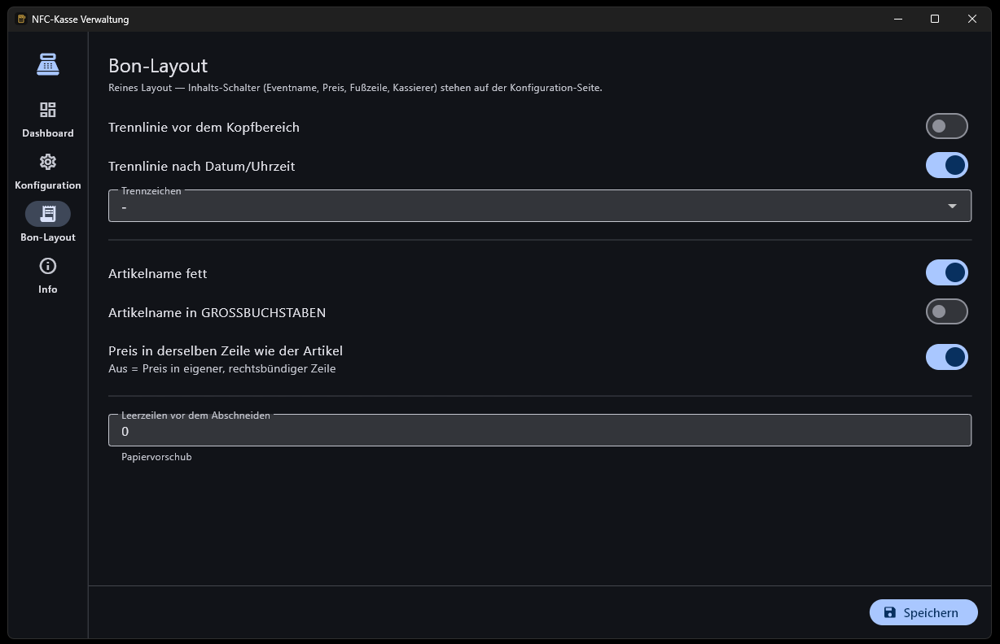

Hier legen Sie fest, wie der gedruckte Bon aussieht: Trennlinien, Trennzeichen, Schrift des Artikelnamens, Preis in derselben oder einer eigenen Zeile, Leerzeilen vor dem Abschneiden. Was auf dem Bon steht, stellen Sie dagegen unter Konfiguration → Bon-Inhalt ein. Die einzelnen Felder erklärt Abschnitt 8.5.

Diese Seite hat nur **Speichern**. Danach auf dem **Dashboard** auf **Neu starten** klicken, sonst druckt die Kasse weiter mit dem alten Layout.

### 3.5 Info und Lizenzen


Die Seite zeigt die Version des Verwaltungstools, die **Installations-ID** und die Ordner von Programm, Daten und Protokollen. Mit dem Symbol rechts kopieren Sie den jeweiligen Wert.

So bekommen Sie eine Lizenz für Pager oder Leaderboard:

1. Auf **Info** neben der Installations-ID auf das Kopier-Symbol klicken.
2. Eine Mail an **kontakt@nfc-kasse.de** schreiben (falls die nicht erreichbar ist: **info@nfc-kasse.de**), die Installations-ID einfügen und dazuschreiben, welche Funktion Sie möchten.
3. Den Schlüssel aus der Antwort unter **Konfiguration** in das passende Lizenzfeld einfügen, den Schalter **… aktiviert** einschalten und **Speichern & Dienst neu starten** klicken.

Der Schlüssel gilt nur für diese Installation. Wie die Funktionen danach eingerichtet werden, steht in der Anleitung Zusatzfunktionen Pager und Leaderboard.

## 4. Erster Start der Kasse

Alles ab hier machen Sie in der Kasse, also in der App auf dem Tablet oder in der Weboberfläche im Browser. Beide sehen gleich aus und können dasselbe. Änderungen an Kategorien, Artikeln und Benutzern wirken sofort auf allen Geräten, ein Neustart ist dafür nicht nötig.

### 4.1 Anmelden

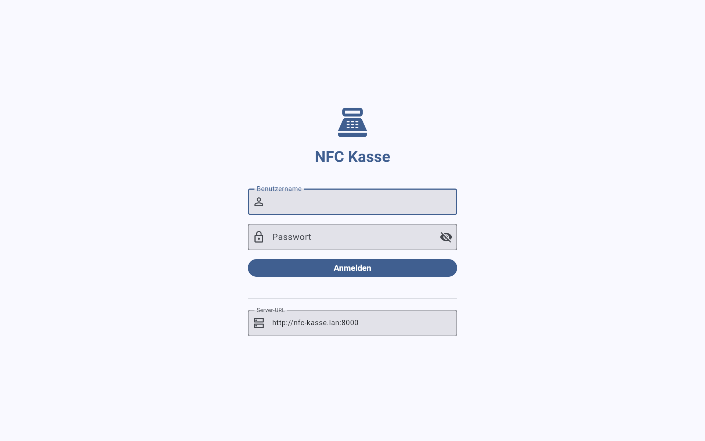

1. Die App öffnen, oder im Browser `http://nfc-kasse.lan:8000/webapp` aufrufen.
2. Unten im Feld **Server-URL** steht bereits `http://nfc-kasse.lan:8000`. Wenn Sie ins Feld tippen, schlägt die App außerdem `http://192.168.1.2:8000` und früher benutzte Adressen vor. Klappt die Anmeldung mit dem Namen nicht, wählen Sie die Adresse mit der Zahl.
3. **Benutzername** und **Passwort** eingeben und auf **Anmelden** tippen.

Die Kasse bleibt angemeldet, auch nach einem Neustart des Geräts. Beim allerersten Mal melden Sie sich mit Benutzer **admin** und Passwort **admin** an.

### 4.2 Admin-Passwort ändern

Das machen Sie sofort nach der ersten Anmeldung, sonst kann sich jeder mit admin/admin anmelden.

1. In der Seitenleiste auf **Benutzer** tippen.
2. Beim Eintrag **Administrator** rechts auf den Stift tippen.
3. Im Feld **Neues Passwort** das neue Passwort eingeben, mindestens 6 Zeichen.
4. **Speichern**.

### 4.3 Die Oberfläche

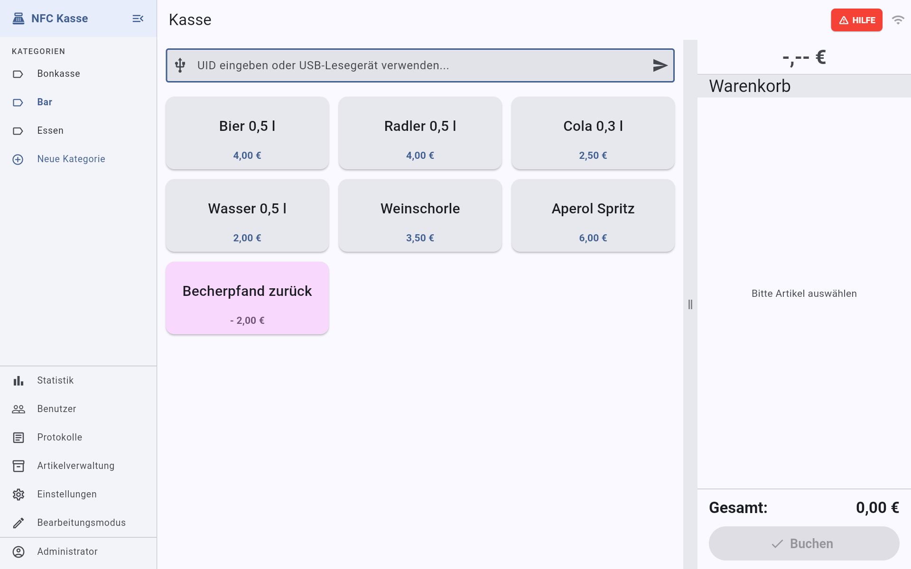

- **Seitenleiste links**: oben die **Kategorien** und **Neue Kategorie**, unten **Statistik**, **Benutzer**, **Protokolle**, **Artikelverwaltung**, **Einstellungen**, in der Kasse außerdem **Bearbeitungsmodus**. Ganz unten steht der Name des angemeldeten Benutzers. Jeder sieht nur, was er darf.
- **Mitte**: oben das Chip-Feld, darunter die Artikel als Kacheln.
- **Rechts**: das Guthaben des gescannten Chips, der Warenkorb und der Knopf **Buchen**. Den Trennbalken zwischen Kacheln und Warenkorb können Sie verschieben.
- **Oben rechts**: der rote Knopf **HILFE** und ein Symbol für die Verbindung zum Server. Ist ein Bluetooth-Leser gekoppelt, steht daneben ein zweites Symbol für den Leser.

Auf dem Smartphone ist die Seitenleiste eingeklappt. Sie öffnet sich mit dem Menü-Symbol oben links, der Warenkorb steht unter den Kacheln.

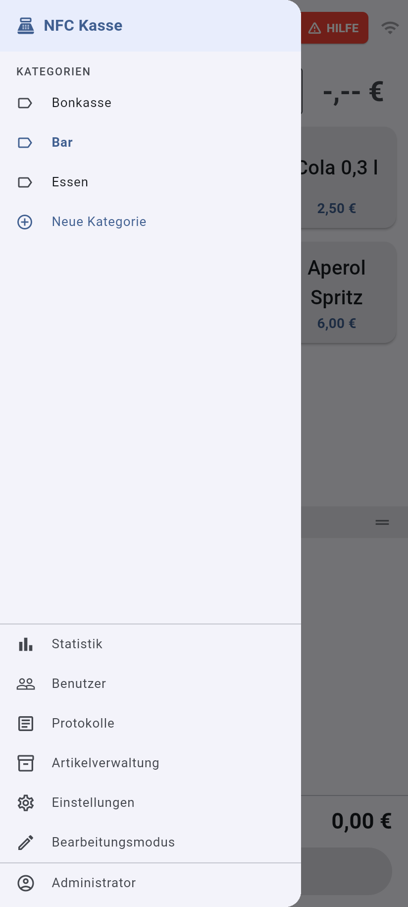

## 5. Kategorien und Artikel

Kategorien sind die Gruppen in der Seitenleiste, meist eine pro Stand, zum Beispiel „Bonkasse“, „Bar“ und „Essen“. Artikel sind die Kacheln, die an der Kasse angetippt werden. Welche Kategorien ein Mitarbeiter sieht, legen Sie in Abschnitt 6 fest.

### 5.1 Kategorie anlegen

1. In der Seitenleiste unter den Kategorien auf **Neue Kategorie** tippen.
2. Den Namen eingeben und auf **Erstellen** tippen.

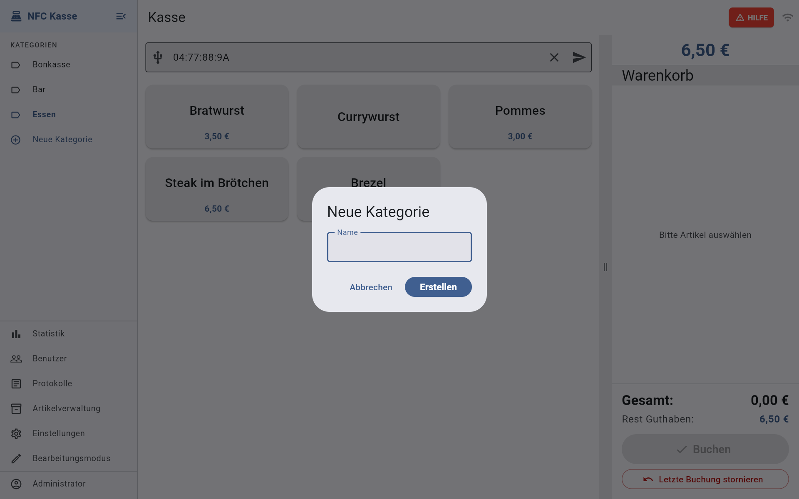

Umbenennen oder löschen: In der Kasse unten in der Seitenleiste **Bearbeitungsmodus** einschalten. Neben jeder Kategorie erscheint ein Stift. Antippen, Namen ändern und speichern, oder die Kategorie löschen. Löschen kann nur, wer das Recht „Kategorie löschen“ hat.

Tipp: Legen Sie für die Bonkasse eine eigene Kategorie an. Dort liegen die Aufladeartikel und der Auszahlungs-Artikel, und nur das Personal der Bonkasse bekommt Zugriff darauf.

### 5.2 Artikel anlegen

1. In der Seitenleiste auf **Artikelverwaltung** tippen. Jede Kategorie erscheint als eigene Karte mit ihren Artikeln.
2. Bei der gewünschten Kategorie rechts auf **+ Neuer Artikel** tippen.
3. **Name** eingeben, so wie er auf der Kachel stehen soll, zum Beispiel „Bier 0,5 l“.
4. **Preis (€)** eingeben, mit Punkt: `4.00`.
5. Bei Bedarf weitere Felder ausfüllen (Tabelle unten).
6. **Speichern**. Die Kachel erscheint sofort auf allen Kassen dieser Kategorie.

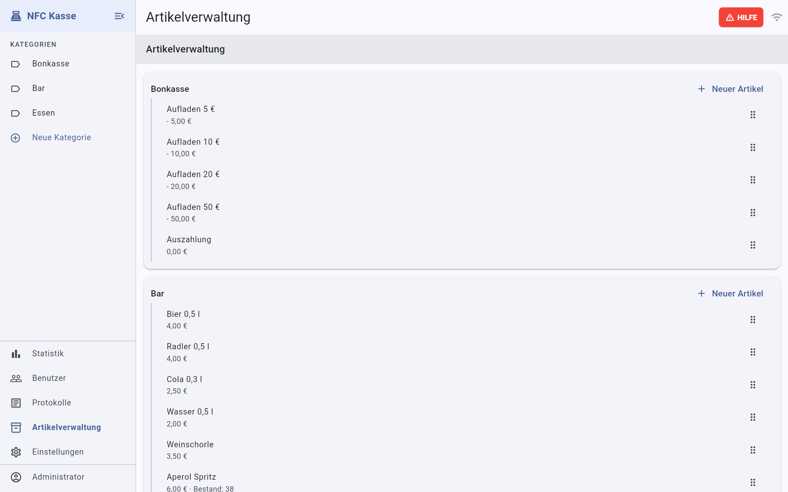

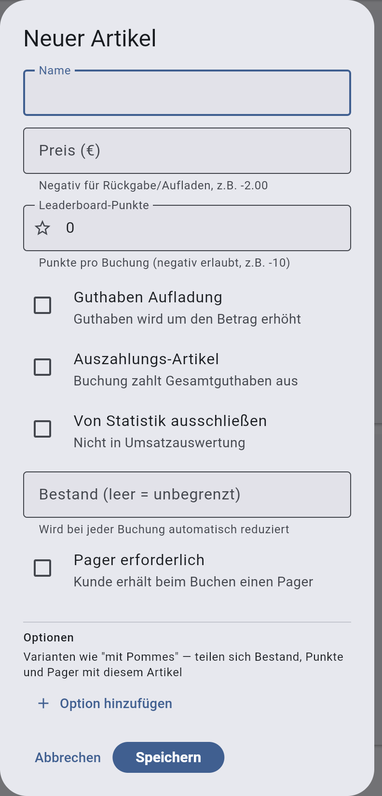

| Feld | Wofür |
| --- | --- |
| Name | Beschriftung der Kachel und Name auf dem Bon. |
| Preis (€) | Verkaufspreis. Ein negativer Preis ist eine Gutschrift, zum Beispiel `-2.00` für „Becherpfand zurück“. |
| Guthaben Aufladung | Macht den Artikel zum Aufladeartikel. Das Preisfeld heißt dann **Auflade-Betrag (€)**, dort tragen Sie den Betrag positiv ein, z. B. `10`. Aufladungen zählen automatisch nicht zum Umsatz. |
| Auszahlungs-Artikel | Zahlt beim Buchen das ganze Restguthaben plus Chip-Pfand aus. Als Preis `0` eintragen. Ein solcher Artikel reicht pro Bonkasse. |
| Von Statistik ausschließen | Der Artikel zählt nicht zum Umsatz, sinnvoll zum Beispiel für Becherpfand. |
| Bestand (leer = unbegrenzt) | Anzahl, die verkauft werden kann. Jede Buchung zählt herunter. Ab 10 Stück warnt die Kasse beim Buchen, bei 0 ist die Kachel rot-weiß umrandet und nicht mehr buchbar. |
| Aktiv (buchbar) | Erscheint erst beim Bearbeiten. Ausgeschaltet bleibt die Kachel grau sichtbar, kann aber nicht gebucht werden. |
| Button-Farbe | Erscheint erst beim Bearbeiten. Farbe der Kachel für Ihr Benutzerkonto (Abschnitt 5.5), das erste Feld bedeutet „keine Farbe“. |
| Leaderboard-Punkte, Pager erforderlich | Nur sichtbar, wenn die Zusatzfunktion freigeschaltet ist. Erklärt in der Anleitung Zusatzfunktionen. |

Für die Bonkasse bewähren sich die Aufladeartikel „Aufladen 5 €“, „10 €“, „20 €“ und „50 €“ plus ein Auszahlungs-Artikel „Auszahlung“.

### 5.3 Artikel mit Optionen

Optionen sind Varianten eines Artikels mit eigenem Preis, zum Beispiel Currywurst „pur“ für 4,50 € und „mit Pommes“ für 7,00 €. An der Kasse gibt es dafür nur eine Kachel, beim Antippen erscheint die Auswahl.

1. In der **Artikelverwaltung** bei der Kategorie **+ Neuer Artikel** tippen.
2. **Name** eingeben, zum Beispiel „Currywurst“.
3. Ganz unten bei **Optionen** auf **+ Option hinzufügen** tippen.
4. Bei **Zusatz** den Text der Variante eingeben, zum Beispiel „mit Pommes“, und bei **Preis (€)** deren Preis, zum Beispiel `7.00`.
5. Für jede weitere Variante wieder **+ Option hinzufügen**, zum Beispiel „pur“ für `4.50`.
6. **Speichern**.

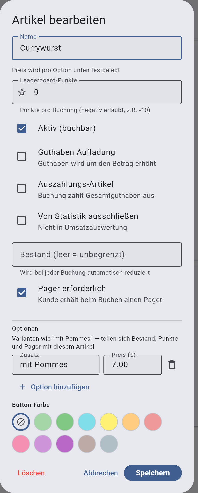

Wichtig:

- Sobald ein Artikel Optionen hat, verschwindet sein eigenes Preisfeld („Preis wird pro Option unten festgelegt“). Gebucht wird immer eine Option. Soll es die Currywurst auch ohne Beilage geben, braucht sie dazu eine eigene Option wie „pur“.
- Im Warenkorb und auf dem Bon steht der volle Name, zum Beispiel „Currywurst mit Pommes“.
- Optionen teilen sich Bestand, Leaderboard-Punkte und Pager mit ihrem Artikel.
- Eine Option entfernen Sie mit dem Mülleimer-Symbol neben ihr.

So sieht das an der Kasse aus: Kachel **Currywurst** antippen, dann die gewünschte Option. Mit **Schließen** wird nichts in den Warenkorb gelegt.

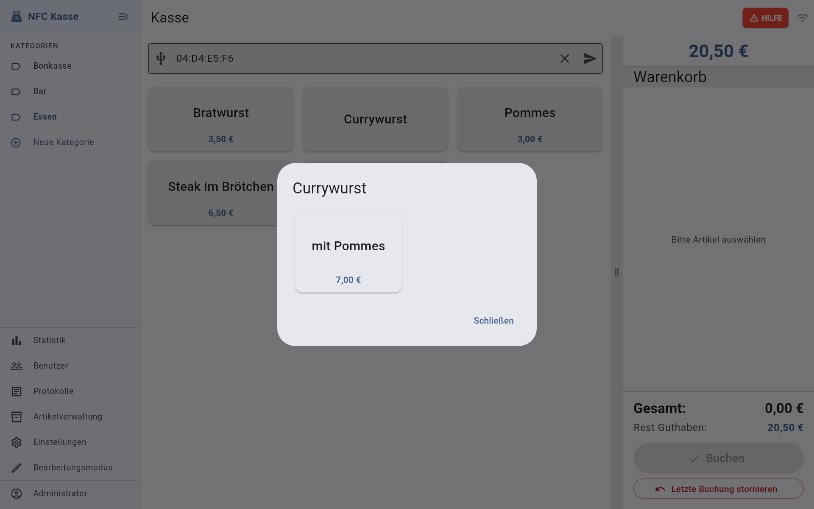

### 5.4 Artikel ändern, verschieben, löschen

- **Ändern**: In der Artikelverwaltung den Artikel antippen, ändern, **Speichern**. Ein neuer Preis gilt nur für neue Buchungen.
- **In eine andere Kategorie verschieben**: Den Artikel lange drücken und auf die Karte der anderen Kategorie ziehen.
- **Löschen**: Im Dialog unten links **Löschen**. Artikel, die schon verkauft wurden, besser mit **Aktiv (buchbar)** ausschalten. Dann bleiben sie für die Auswertung erkennbar und lassen sich später wieder einschalten.

### 5.5 Kacheln anordnen und Bestand nachfüllen

1. In der Kasse unten in der Seitenleiste **Bearbeitungsmodus** tippen.
2. Eine Kachel lange drücken und an die neue Stelle ziehen.
3. Mit den runden Knöpfen unten rechts fügen Sie eine leere Position ein oder entfernen die letzte wieder. So lassen sich Gruppen bilden, zum Beispiel alle alkoholfreien Getränke in einer Reihe.
4. Eine Kachel antippen öffnet ein kleines Fenster für **Farbe** und **Bestand**, praktisch zum Nachfüllen während des Betriebs.
5. Zum Beenden wieder auf **Bearbeitungsmodus** tippen.

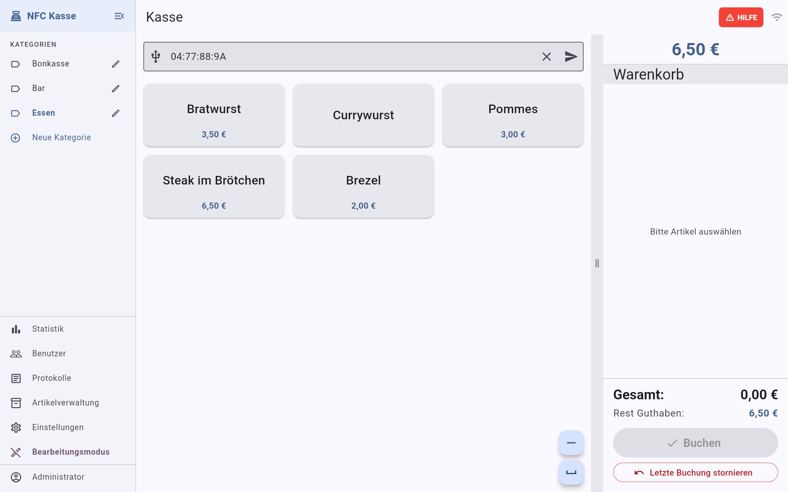

Anordnung und Farbe der Kacheln speichert die Kasse für das Benutzerkonto, mit dem Sie sie ändern, getrennt für Hoch- und Querformat. Sie gelten auf jedem Gerät, an dem sich dieses Konto anmeldet, andere Konten sehen ihre eigene Anordnung. Richten Sie die Kacheln deshalb mit dem Konto ein, das später am Stand kassiert. Der Bestand gilt dagegen für alle Kassen.

## 6. Mitarbeiter-Konten und Rechte

Jede Person, die kassiert, bekommt ein eigenes Konto. So sieht sie nur ihre Kategorien, und in der Auswertung ist erkennbar, wer was gebucht hat. Rechte gibt es auf zwei Ebenen: **globale Berechtigungen** für Aufgaben außerhalb der Kasse und **Rechte pro Kategorie** für Buchen, Storno und Artikel.

### 6.1 Konto anlegen

1. In der Seitenleiste auf **Benutzer** tippen, dann oben rechts auf **Neu**.
2. **Benutzername** eingeben, mit dem sich die Person anmeldet, zum Beispiel „anna“.
3. Optional einen **Anzeigenamen**, zum Beispiel „Anna (Bar)“. Er erscheint in der Seitenleiste und auf gedruckten Bons.
4. Ein **Passwort** mit mindestens 6 Zeichen vergeben.
5. Unter **Globale Berechtigungen** ankreuzen, was die Person außerhalb der Kasse darf (Tabelle 6.2). Für normales Standpersonal bleibt hier alles leer.
6. Unter **Kategorien & Berechtigungen** bei jeder Kategorie, an der die Person arbeitet, die Rechte setzen (Abschnitt 6.3).
7. **Speichern**.

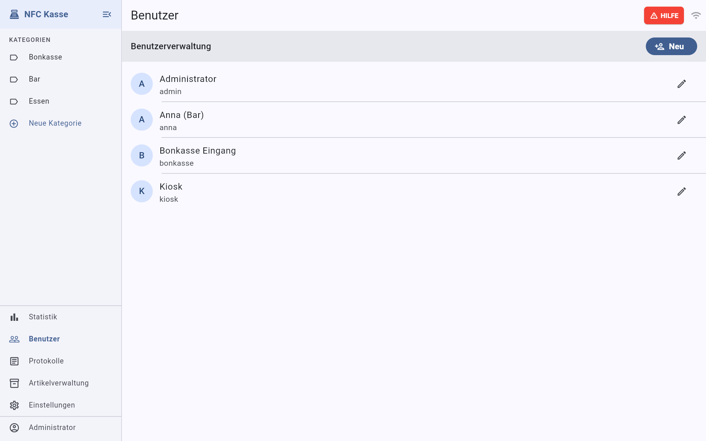

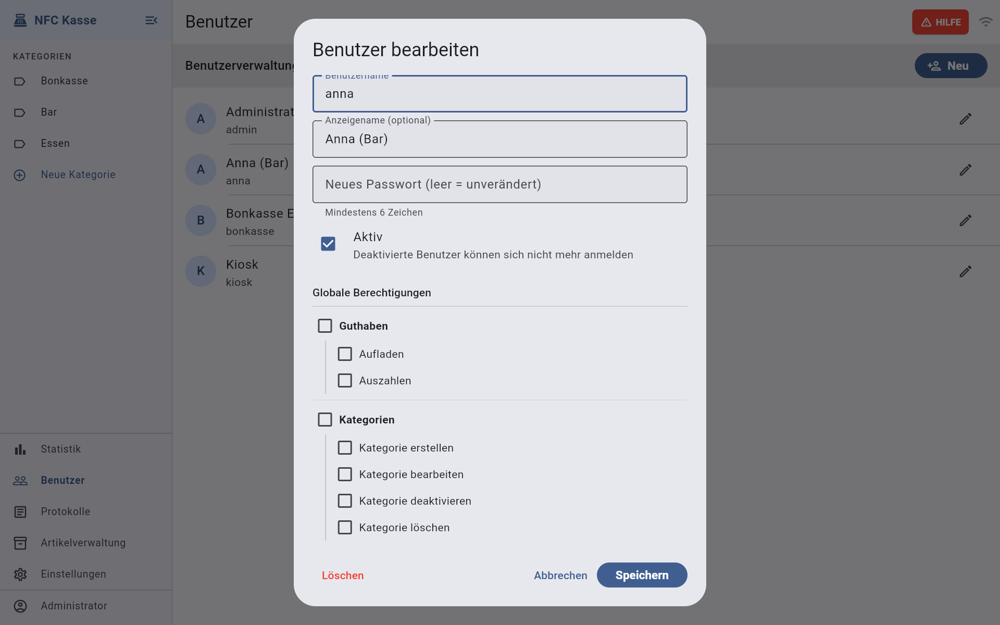

### 6.2 Globale Berechtigungen

| Gruppe | Häkchen | Wirkung |
| --- | --- | --- |
| Kategorien | Kategorie erstellen, bearbeiten, deaktivieren, löschen | Wer auch nur eines davon hat, gilt als **Verantwortlicher**: Er sieht alle Kategorien, darf dort alles und unbegrenzt stornieren. |
| Statistik & Finanzen | Umsatz einsehen | Statistik mit Übersicht und Chips, Tagesabschluss, Neues Event |
|  | Transaktionen einsehen | Reiter Transaktionen in der Statistik |
|  | Daten exportieren | Export der Daten |
| Benutzerverwaltung | Benutzer anzeigen, erstellen, bearbeiten, deaktivieren, löschen, Rechte vergeben | Konten verwalten wie in diesem Abschnitt |
| Notfall | Notfall-Kontakt | Bekommt die Hilfe-Anfragen der Kassen (Abschnitt 9.8) |
| Bon-Druck | Bon drucken | Darf ohne Chip verkaufen und Papierbons drucken (Abschnitt 8.6) |
| Kundenterminal | Kiosk-Modus | Das Konto zeigt nur die Guthaben-Abfrage für Gäste (Abschnitt 12.4) |
| Protokolle | Protokolle einsehen, Protokoll-Level verwalten | Protokolle in der App ansehen, bei Problemen |

Aufladen und Auszahlen an der Bonkasse erlaubt das Recht **Buchen** in der Kategorie der Bonkasse. Die Häkchen unter **Guthaben** brauchen Sie dafür nicht.

### 6.3 Rechte pro Kategorie

Unter **Kategorien & Berechtigungen** steht jede Kategorie mit einem aufklappbaren Baum:

- **Buchungen → Buchen**: Die Person sieht die Kategorie und darf dort verkaufen. Ohne dieses Häkchen bleibt die Kategorie für sie unsichtbar.
- **Buchungen → Storno** mit **5 min** oder **Unbegrenzt**: Mit „5 min“ darf die Person eine Buchung nur in den ersten fünf Minuten zurücknehmen, mit „Unbegrenzt“ jederzeit. Es gilt immer nur eins von beiden.
- **Positionen → Erstellen, Bearbeiten, Deaktivieren, Löschen**: Artikel dieser Kategorie verwalten (Abschnitt 5).

Ein Häkchen an der Kategorie selbst setzt oder entfernt alle Rechte darunter auf einmal.

### 6.4 Bewährte Einstellungen

| Rolle | Globale Berechtigungen | Rechte pro Kategorie |
| --- | --- | --- |
| Standpersonal, z. B. Bar | keine | Bar: Buchen, Storno 5 min |
| Bonkasse | bei Barverkauf mit Bon: Bon drucken | Bonkasse: Buchen, Storno 5 min |
| Schichtleitung | Kategorie bearbeiten, Umsatz einsehen, Notfall-Kontakt | keine nötig, sieht als Verantwortliche alles |
| Gäste-Terminal | Kiosk-Modus | keine |

Ein Gerät, an dem sich alle Leute eines Standes abwechseln, kann auch mit einem gemeinsamen Konto pro Stand laufen, zum Beispiel „bar“. Dann ist in der Auswertung aber nicht mehr erkennbar, wer gebucht hat.

### 6.5 Passwort ändern, Konto sperren

- **Passwort ändern**: Benutzer → Stift beim Konto → **Neues Passwort** eingeben → **Speichern**. Leer lassen bedeutet: unverändert.
- **Konto sperren**: Das Häkchen **Aktiv** entfernen. Die Person kann sich nicht mehr anmelden, ihre Buchungen bleiben in der Auswertung erhalten. Das ist besser als Löschen.

## 7. Bluetooth-NFC-Leser verbinden

Der NFC-Leser ist ein kleines Gerät mit Akku. Er liest den Chip und schickt dessen Nummer per Bluetooth an die Kasse. Er hat nur zwei Bedienelemente: einen **Schiebeschalter** zum Ein- und Ausschalten und eine **USB-C-Buchse** zum Laden. Auf der Rückseite steht sein Name, zum Beispiel **NFC-Reader\_0001**. Am Leser selbst müssen Sie nichts einstellen.

Jeder Leser gehört zu genau einer Kasse. Kleben Sie am besten die Nummer des Lesers auch auf das passende Tablet.

### 7.1 Laden

1. Ein USB-C-Kabel an die Buchse des Lesers stecken, das andere Ende an ein USB-Netzteil oder an den Laptop.
2. Vor jeder Veranstaltung voll laden. Den Akkustand zeigt die Kasse an, sobald der Leser verbunden ist.
3. Nach der Veranstaltung den Leser mit dem Schiebeschalter ausschalten.

### 7.2 Mit der Android-App verbinden

1. Den Leser mit dem Schiebeschalter einschalten.
2. Am Tablet Bluetooth einschalten. Den Leser **nicht** in den Bluetooth-Einstellungen von Android koppeln, das erledigt die App.
3. In der App **Einstellungen** öffnen, Reiter **NFC-Lesegerät**.
4. Auf **Nach Geräten suchen** tippen.
5. Beim ersten Mal fragt Android nach der Berechtigung **Geräte in der Nähe**, bei älteren Geräten nach dem **Standort**. Erlauben.
6. Die Liste zeigt alle eingeschalteten Leser in Reichweite mit Namen und Signalstärke. Den Leser antippen, dessen Name auf der Rückseite steht.
7. Unter **Gekoppeltes Lesegerät** steht jetzt „Verbunden · Akku … %“. Fertig.

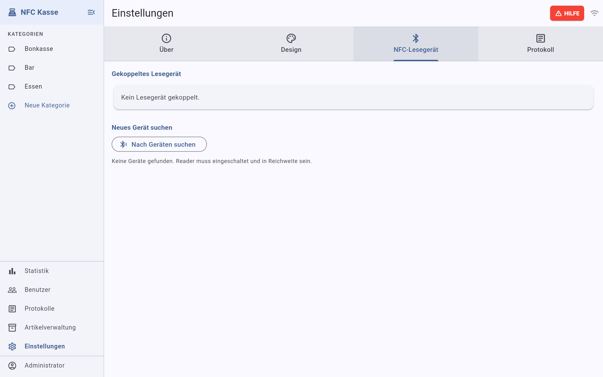

Liegen mehrere Leser nebeneinander, hilft die Signalstärke: Der Wert näher an null gehört zum nächsten Leser, „−45 dBm“ ist also näher als „−80 dBm“.

Die App merkt sich den Leser. Beim nächsten Start und nach einem kurzen Abbruch, etwa wenn der Leser aus- und wieder eingeschaltet wurde, verbindet sie sich von selbst wieder.

### 7.3 Im Browser verbinden

In der Weboberfläche funktioniert der Leser mit **Google Chrome** und **Microsoft Edge**, nicht mit Firefox oder Safari. Auf dem Server-Laptop hat das Setup alles vorbereitet. Auf jedem anderen PC muss die Adresse der Kasse einmal im Browser als vertrauenswürdig eingetragen werden. Wie das geht, steht im Handbuch für Systemadministratoren, Abschnitt 8.

1. Den Leser einschalten. Am PC Bluetooth einschalten: Windows **Einstellungen → Bluetooth und Geräte → Bluetooth** auf Ein. Den Leser nicht in Windows koppeln.
2. In der Kasse **Einstellungen → NFC-Lesegerät → Nach Geräten suchen**.
3. Der Browser öffnet ein eigenes Fenster mit den gefundenen Lesern. Den richtigen Leser wählen und auf **Koppeln** klicken.
4. Der Leser erscheint danach in der Liste der Kasse. Antippen, bis „Verbunden“ erscheint.

Zwei Einschränkungen des Browsers sind normal:

- Nach jedem Neuladen der Seite steht der Leser auf „Getrennt“. Dann im Menü neben dem Leser **Verbinden** wählen und im Fenster des Browsers erneut bestätigen.
- Wird der Leser ausgeschaltet oder ist er außer Reichweite, merkt die Kasse das erst nach bis zu 90 Sekunden.

### 7.4 Status und Menü

- Ein Symbol oben rechts, neben dem Symbol für den Server, zeigt jederzeit, ob der Leser verbunden ist.
- Im Menü neben dem gekoppelten Leser stehen **Verbinden**, **Trennen** und **Entkoppeln**. Mit **Entkoppeln** vergisst die Kasse den Leser. Das brauchen Sie, wenn ein anderer Leser an diese Kasse soll.

### 7.5 Andere Wege, den Chip zu lesen

- **Eingebautes NFC (Android)**: Den Chip an die Rückseite des Tablets halten. NFC muss in den Android-Einstellungen eingeschaltet sein.
- **USB-Leser**: Er tippt die Nummer wie eine Tastatur ein. Vorher einmal ins Chip-Feld tippen, damit es aktiv ist.
- **Von Hand**: Die Chip-Nummer ins Chip-Feld tippen und mit Enter oder dem Pfeil rechts bestätigen.

## 8. Bondrucker einrichten und Bon gestalten

Der Bondrucker ist optional. Er ist für Gäste gedacht, die keinen Chip möchten: Sie zahlen an der Bonkasse bar und bekommen für jeden Artikel einen Papierbon, den sie am Stand einlösen. Gedruckt wird über den Server, deshalb kann jede Kasse Bons drucken, auch ein Smartphone.

### 8.1 Welcher Drucker?

NFC-Kasse ist an kein bestimmtes Modell gebunden. Geeignet ist jeder Bondrucker (Thermodrucker) mit dem Standard ESC/POS, für 80-mm- oder 58-mm-Papier. Empfohlen sind Drucker mit **Netzwerkanschluss (LAN)**: Sie können überall im Netz stehen, und es gibt keine Probleme mit Treibern oder COM-Ports.

Diese Modelle wurden getestet:

| Modell | Anschluss | Einstellungen |
| --- | --- | --- |
| Epson TM-T88II | seriell, am Laptop über einen USB-Seriell-Adapter | 80 mm, 42 Zeichen pro Zeile, 9600 Baud, mit Abschneider |
| Zweites getestetes Modell (Angabe folgt) |  |  |

### 8.2 Netzwerkdrucker einrichten (empfohlen)

1. Den Drucker mit einem LAN-Kabel an den Router anschließen und einschalten.
2. Einen Selbsttest drucken. Bei den meisten Modellen hält man dazu die Vorschub-Taste beim Einschalten gedrückt. Der Ausdruck zeigt die IP-Adresse des Druckers.
3. Im Router eine feste Adresse für den Drucker einrichten, üblich ist `192.168.1.3`. Das beschreibt das Handbuch für Systemadministratoren in Abschnitt 2.3 und 9.1.
4. Am Server-Laptop das Verwaltungstool öffnen, Seite **Konfiguration**, Bereich **Bondrucker**.
5. **Anschlussart** auf `network` stellen. Die Felder ändern sich dann.
6. **TCP-Port**: `9100`. **Drucker-IP-Adresse**: die Adresse aus Schritt 3, zum Beispiel `192.168.1.3`.
7. **Zeichen pro Zeile**: `42` bei 80-mm-Papier, meist `32` bei 58-mm-Papier.
8. **Bon automatisch abschneiden** nur einschalten, wenn der Drucker einen Abschneider hat.
9. **Speichern & Dienst neu starten**.
10. Einen Testbon drucken wie in Abschnitt 8.6.

### 8.3 Drucker mit Kabel am Laptop (seriell)

1. Den Drucker über seinen seriellen Anschluss und einen USB-Seriell-Adapter an den Server-Laptop anschließen. Den Treiber des Adapters installieren, falls Windows ihn nicht selbst findet.
2. Im Windows-**Geräte-Manager** unter **Anschlüsse (COM & LPT)** nachsehen, welchen COM-Port der Adapter bekommen hat, zum Beispiel `COM3`.
3. Im Verwaltungstool unter **Konfiguration → Bondrucker**: **Anschlussart** `serial`, **COM-Port** `COM3`.
4. **Baudrate** wie am Drucker eingestellt. Sie steht auf dem Selbsttest, beim Epson TM-T88II sind es ab Werk `9600`.
5. **Zeichen pro Zeile** und **Bon automatisch abschneiden** wie in 8.2.
6. **Speichern & Dienst neu starten** und einen Testbon drucken.

Den Adapter immer in dieselbe USB-Buchse stecken. In einer anderen Buchse kann Windows ihm eine andere COM-Nummer geben. Drucker mit USB-Anschluss funktionieren nur, wenn sie unter Windows als COM-Port erscheinen.

### 8.4 Was auf dem Bon steht

Im Verwaltungstool auf der Seite **Konfiguration**, Bereich **Bon-Inhalt**:

| Schalter oder Feld | Wirkung |
| --- | --- |
| Veranstaltungsname anzeigen | Name der Veranstaltung oben, fett und mittig |
| Datum + Uhrzeit anzeigen | Datum und Uhrzeit des Verkaufs, mittig |
| Preis anzeigen | Preis des Artikels |
| Fußzeilentext | Eine Zeile unter dem Artikel, zum Beispiel „Vielen Dank!“ oder „Nur am 04.10. gültig“. Leer = keine Zeile. |
| Kassierer anzeigen | Name der Person, die gedruckt hat. Es wird der Anzeigename aus dem Benutzerkonto gedruckt. |
| Kassierer-Bezeichnung | Wort vor dem Namen, zum Beispiel „Kassierer“ oder „Bedienung“ |

Danach **Speichern & Dienst neu starten**.

### 8.5 Wie der Bon aussieht

Im Verwaltungstool auf der Seite **Bon-Layout**:

| Schalter oder Feld | Wirkung |
| --- | --- |
| Trennlinie vor dem Kopfbereich | Linie ganz oben, vor dem Veranstaltungsnamen |
| Trennlinie nach Datum/Uhrzeit | Linie zwischen Kopf und Artikel |
| Trennzeichen | Zeichen, aus dem die Linie besteht: `-`, `=`, `*` oder `─` |
| Artikelname fett | Artikelname in fetter Schrift |
| Artikelname in GROSSBUCHSTABEN | Artikelname komplett groß |
| Preis in derselben Zeile wie der Artikel | Preis rechts neben dem Namen. Aus = Preis in einer eigenen, rechtsbündigen Zeile. |
| Leerzeilen vor dem Abschneiden | Papiervorschub am Ende. Bei Druckern, die zu früh abschneiden, auf 2 bis 4 erhöhen. |

Danach **Speichern** und auf dem **Dashboard** **Neu starten**. So sieht ein Bon mit den Standardwerten auf 80-mm-Papier aus:

```
              Weinfest 2026
          04.10.2026  19:42 Uhr
------------------------------------------
Bier 0,5 l                        4,00 EUR
Vielen Dank!
Kassierer: Anna (Bar)
```

Der Preis steht als „EUR“, weil viele Bondrucker das Euro-Zeichen nicht drucken können.

### 8.6 Bons an der Kasse drucken

Dafür braucht das Konto das Recht **Bon drucken** (Abschnitt 6.2).

1. Kategorie wählen und die Artikel antippen. **Keinen Chip scannen.**
2. Solange kein Chip gescannt ist, heißt der Knopf unten **Drucken** statt Buchen.
3. Den Betrag unter **Gesamt** bar kassieren.
4. **Drucken** tippen. Die Meldung „3 Bons gedruckt“ erscheint.
5. Die Bons dem Gast geben. Am Stand gibt der Gast einen Bon pro Artikel ab.

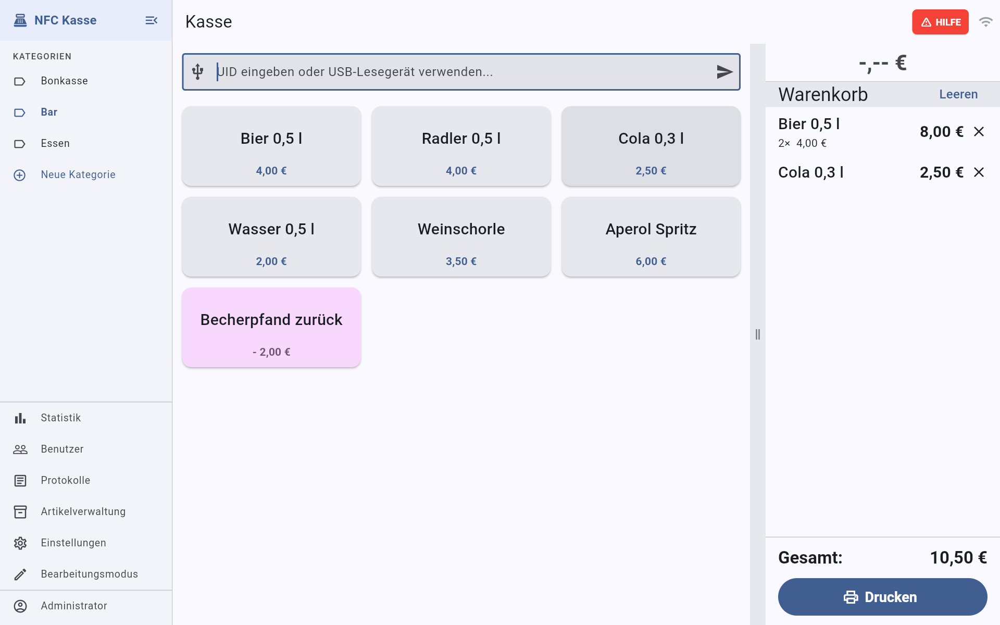

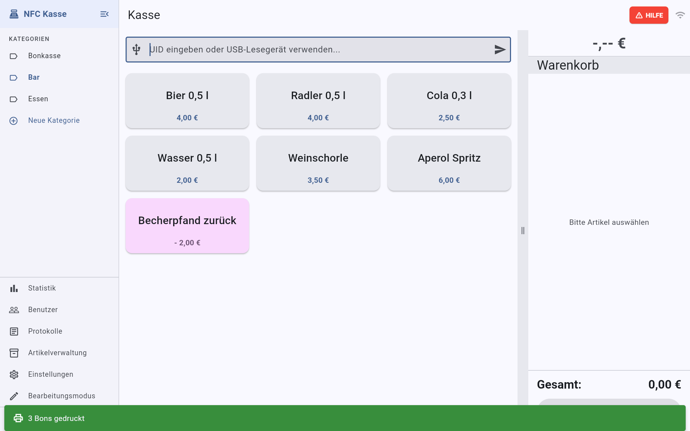

Gedruckt wird ein Bon pro Stück: zwei Bier und eine Cola ergeben drei Bons. Der Verkauf wird auf den gedachten Chip „BAR“ gebucht und erscheint in der Statistik wie jeder andere Verkauf. Wurde versehentlich ein Chip gescannt, steht dort wieder **Buchen**. Dann das Chip-Feld mit dem × leeren.

### 8.7 Wenn nichts gedruckt wird

- Bons gehen nie verloren. Ist der Drucker kurz nicht erreichbar, warten sie und werden gedruckt, sobald er wieder da ist. Die Meldung „Bons gedruckt“ erscheint trotzdem sofort. **Nicht noch einmal auf Drucken tippen**, sonst kommen die Bons doppelt.
- Prüfen: Strom, Papier, Deckel geschlossen, Kabel fest.
- Netzwerkdrucker: Stimmt die Drucker-IP-Adresse im Verwaltungstool mit dem Selbsttest überein?
- Kabeldrucker: Stimmt der COM-Port mit dem Geräte-Manager überein?
- Nach jeder Änderung **Speichern & Dienst neu starten**.

Weitere Prüfungen stehen im Handbuch für Systemadministratoren, Abschnitt 9.

## 9. Verkaufen im Betrieb

Für das Standpersonal reicht die Kurzanleitung. Hier steht der ganze Ablauf, auch für die Bonkasse.

### 9.1 Ein Verkauf Schritt für Schritt

1. In der Seitenleiste die Kategorie wählen. Auf dem Smartphone öffnet das Menü-Symbol oben links die Seitenleiste.
2. Die Artikel antippen. Jedes Antippen legt ein Stück mehr in den Warenkorb, dort steht dann zum Beispiel „2× 4,00 €“. Hat ein Artikel Optionen, erscheint zuerst die Auswahl.
3. Den Chip an den Leser halten, bei eingebautem NFC an die Rückseite des Tablets. Das Guthaben erscheint groß über dem Warenkorb. Die Reihenfolge ist egal, der Chip darf auch zuerst gescannt werden.
4. Unten prüfen: **Gesamt** ist der Preis, **Rest Guthaben** das, was danach auf dem Chip bleibt.
5. **Buchen** tippen. Die grüne Meldung „Buchung bestätigt“ erscheint, Warenkorb und Chip werden geleert.

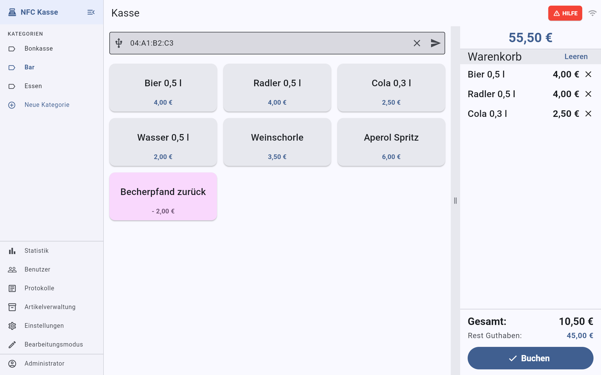

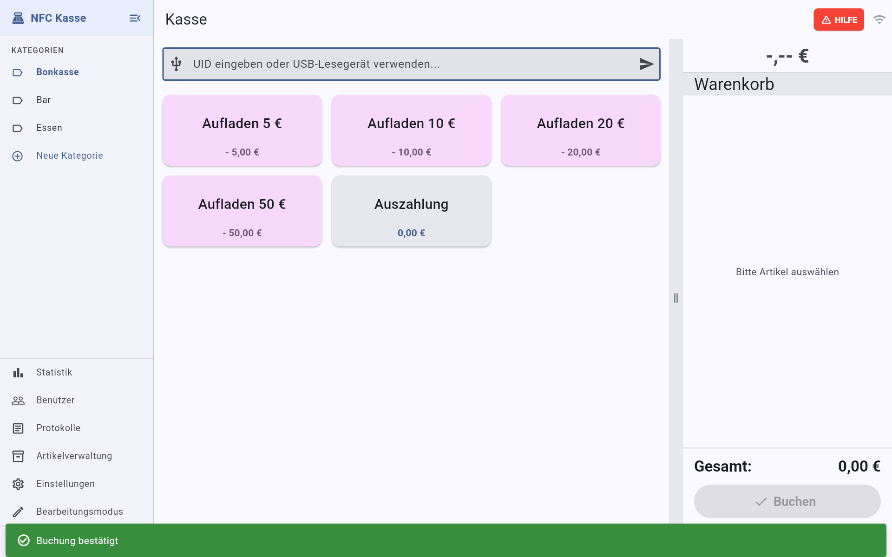

Einen Artikel entfernen Sie mit dem × daneben, **Leeren** löscht den ganzen Warenkorb. Das × im Chip-Feld entfernt den gescannten Chip.

### 9.2 Wenn das Guthaben nicht reicht

Ist **Rest Guthaben** rot, reicht das Guthaben nicht und **Buchen** ist grau. Dann Artikel entfernen oder den Gast zum Aufladen an die Bonkasse schicken. Grau ist Buchen außerdem, solange kein Chip gescannt oder der Warenkorb leer ist.

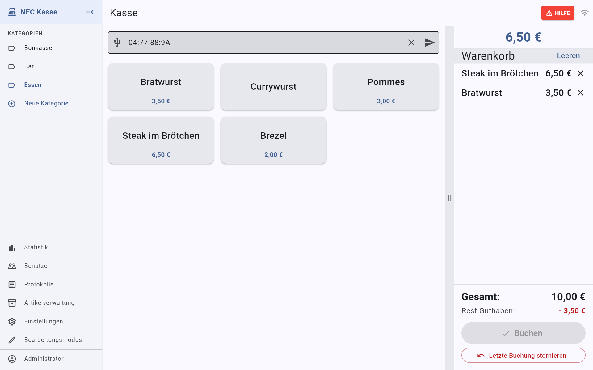

### 9.3 Neuer Chip und Chip-Pfand

Wird ein Chip zum ersten Mal benutzt, steht über dem Guthaben **Neuer Kunde**. Ist ein Chip-Pfand eingestellt (Abschnitt 3.3), liegt im Warenkorb automatisch die gesperrte Zeile **Chip Pfand**. Sie lässt sich nicht entfernen. Der Pfand wird mit der ersten Buchung vom Guthaben abgezogen, meist mit der ersten Aufladung.

Beispiel bei 3 € Pfand: Der Gast zahlt 20 € bar, Sie buchen „Aufladen 20 €“, danach stehen 17 € auf dem Chip.

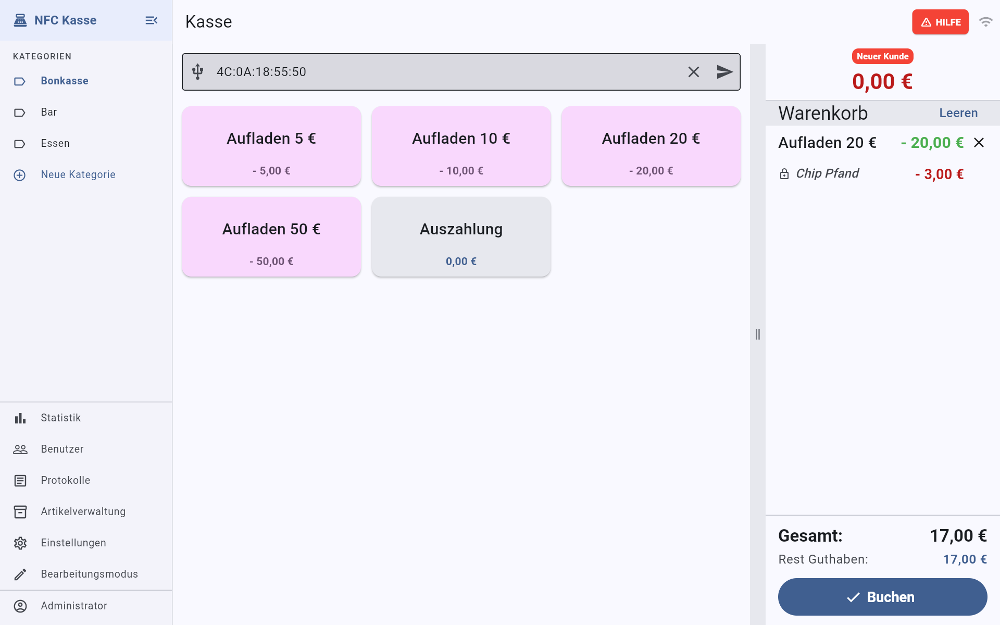

### 9.4 Guthaben aufladen (Bonkasse)

1. Die Kategorie der Bonkasse wählen.
2. Aufladeartikel antippen, zum Beispiel zweimal „Aufladen 10 €“ für 20 €. Der Betrag steht im Warenkorb grün mit Minus davor, das ist eine Gutschrift für den Gast.
3. Den Chip scannen.
4. Bargeld in Höhe der Aufladeartikel annehmen, im Beispiel 20 €.
5. **Buchen** tippen. Das neue Guthaben erscheint.

### 9.5 Letzte Buchung stornieren

Nach jeder Buchung erscheint unter dem großen Knopf **Letzte Buchung stornieren**.

1. Antippen. Das Fenster „Buchung stornieren?“ zeigt die Artikel dieser Buchung.
2. Prüfen, ob es die richtige ist, und **Buchung stornieren** tippen.
3. Der Betrag geht zurück auf den Chip, ein verbrauchter Bestand wird zurückgebucht.

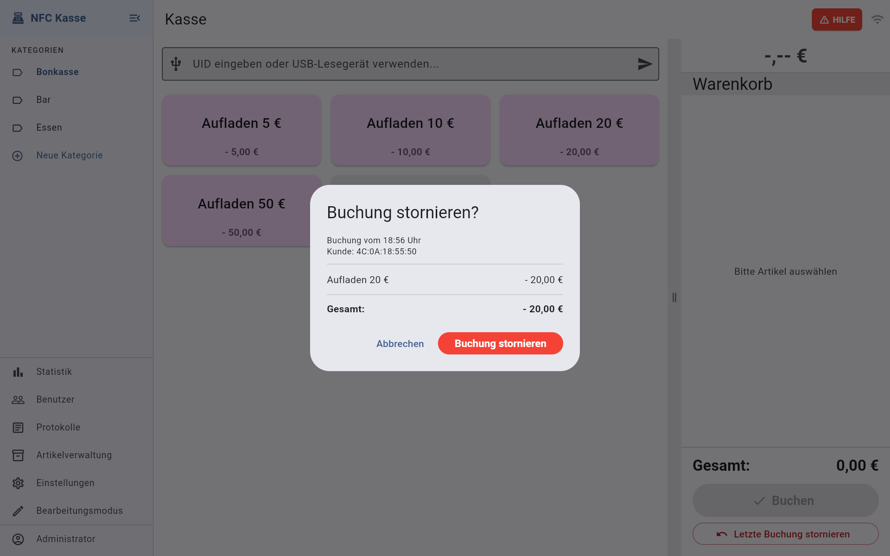

Stornieren lässt sich nur die letzte Buchung dieses Geräts. Nach der nächsten Buchung geht das nicht mehr. Wer nur „Storno 5 min“ hat, kann außerdem nur in den ersten fünf Minuten stornieren. Danach meldet die Kasse „Storno-Zeitfenster von 5 Minuten abgelaufen“, dann die Schichtleitung holen.

### 9.6 Guthaben auszahlen (Bonkasse)

1. Die Kategorie der Bonkasse wählen und den Chip scannen.
2. Den Auszahlungs-Artikel antippen, zum Beispiel „Auszahlung“. Er muss allein im Warenkorb liegen.
3. Der Warenkorb zeigt die Zeile **Chip Pfand Rückgabe** und darunter den **Auszahlungsbetrag**: Restguthaben plus Pfand.
4. **Auszahlen** tippen.
5. Erst nach der Bestätigung genau den Auszahlungsbetrag bar auszahlen und den Chip einbehalten.

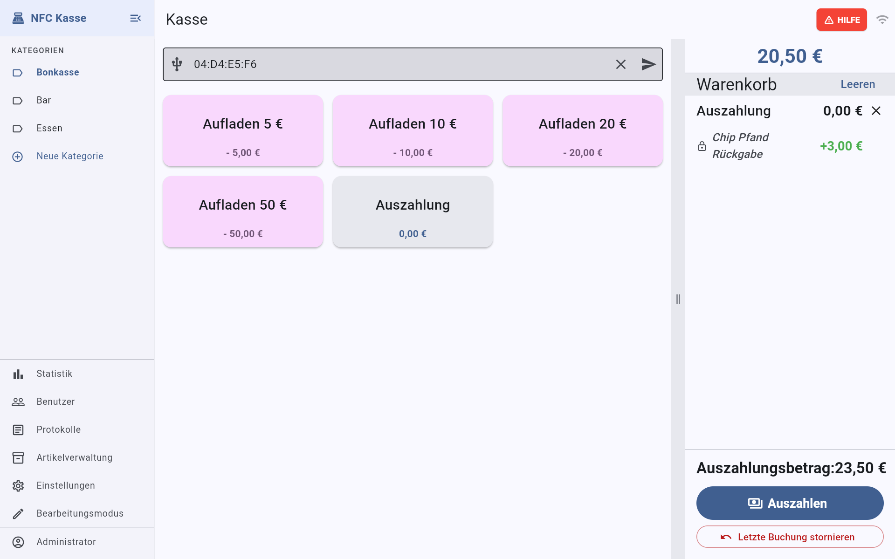

Der Chip ist danach wieder frei. Beim nächsten Gast gilt er als neuer Chip, und der Pfand wird wieder fällig.

### 9.7 Ohne Chip mit Bon verkaufen

Steht ein Bondrucker bereit, können Gäste auch bar zahlen und bekommen Papierbons. Wie das geht, steht in Abschnitt 8.6.

### 9.8 Hilfe anfordern

1. Oben rechts auf den roten Knopf **HILFE** tippen.
2. Im Fenster **Hilfe anfordern** auf **HILFE ANFORDERN** tippen. Der Knopf zeigt jetzt „HILFE Angefordert“.
3. Alle angemeldeten Notfall-Kontakte (Abschnitt 6.2) bekommen die Meldung „Hilfe benötigt!“ und antworten mit **Auf dem Weg**, **5 Minuten** oder **Nicht möglich**.
4. Die Antwort erscheint sofort an der Kasse, der Knopf zeigt dann zum Beispiel „Hilfe Kommt!“. Antippen zeigt, wer geantwortet hat.
5. Ist das Problem gelöst, den Knopf antippen und **Erledigt** wählen.

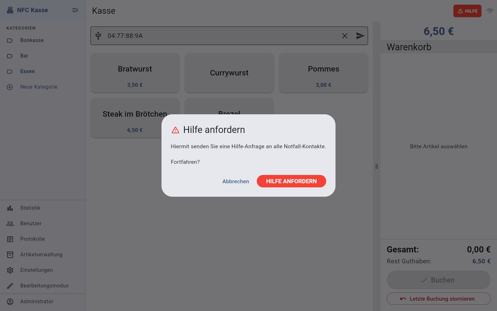

Damit Hilfe-Anfragen ankommen, muss mindestens ein Notfall-Kontakt während der Veranstaltung an einem Gerät angemeldet sein, zum Beispiel am Smartphone der Schichtleitung.

### 9.9 Schichtende

1. Unten in der Seitenleiste auf den eigenen Namen tippen und **Abmelden** wählen.
2. Tablets und Leser laden.

In der nächsten Schicht meldet sich die nächste Person mit ihrem eigenen Konto an.

## 10. Statistik anzeigen

Die Statistik zeigt Umsatz, alle Buchungen und den Stand jedes Chips, live während der Veranstaltung. Sie öffnet sich über **Statistik** in der Seitenleiste. Dafür braucht das Konto das Recht **Umsatz einsehen**, für den Reiter Transaktionen zusätzlich **Transaktionen einsehen** (Abschnitt 6.2).

### 10.1 Zeitraum wählen

Die Buchungen sind in **Perioden** eingeteilt, meist eine pro Veranstaltungstag. Eine neue Periode beginnt mit jedem Tagesabschluss (Abschnitt 11).

1. Oben auf das Feld mit dem Kalender tippen. Es zeigt die aktuelle Periode, zum Beispiel „Start (aktiv seit 03.10. 18:34)“.
2. Im Fenster **Zeitraum auswählen** eine oder mehrere Perioden ankreuzen, oder **Alle Zeiten** für alles seit Beginn.
3. **Übernehmen** tippen. Alle drei Reiter zeigen jetzt diesen Zeitraum.

### 10.2 Übersicht

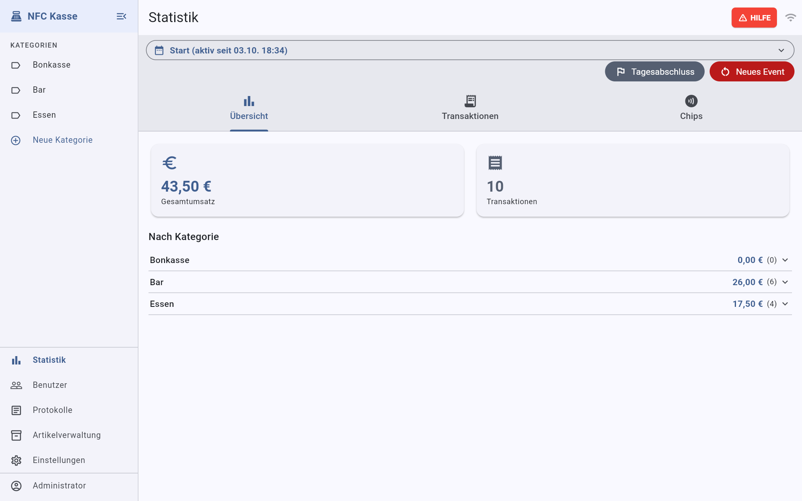

- **Gesamtumsatz**: alle Verkäufe im Zeitraum, ohne Stornos. Aufladungen, Auszahlungen und Artikel mit „Von Statistik ausschließen“ zählen nicht mit. Barverkäufe mit Bon zählen mit.
- **Transaktionen**: Anzahl der Buchungen.
- **Nach Kategorie**: Umsatz je Kategorie, in Klammern die Anzahl. Eine Kategorie antippen, um den Umsatz jedes einzelnen Artikels zu sehen.

### 10.3 Transaktionen

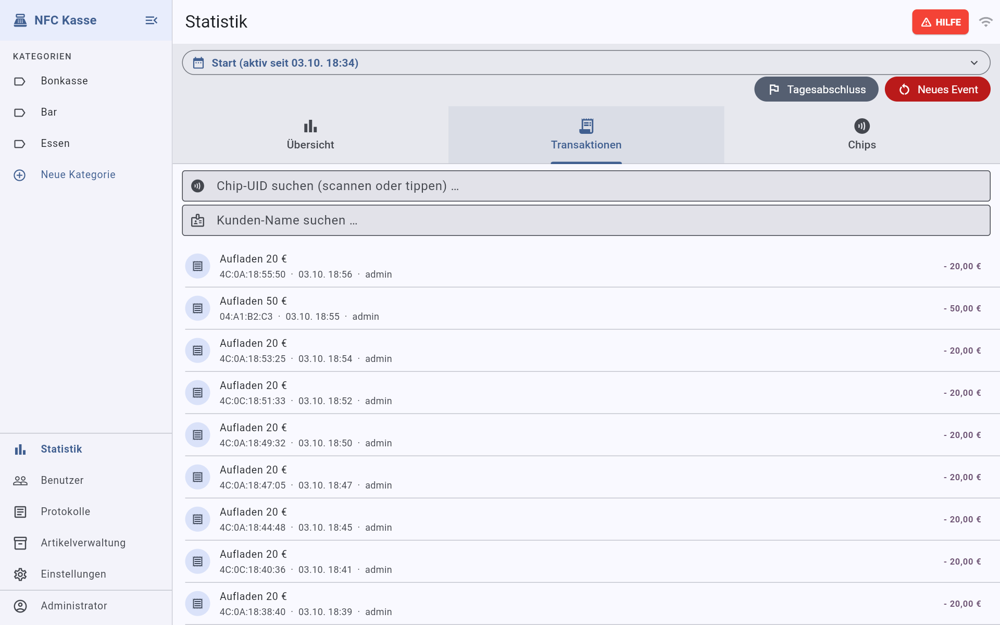

- Jede Zeile ist eine Buchung mit Artikel, Chip-Nummer, Uhrzeit und dem Benutzer, der gebucht hat. Buchungen mit mehreren Artikeln lassen sich aufklappen.
- Stornierte Buchungen haben ein durchgestrichenes Symbol und zählen nicht zum Betrag.
- Aufladungen stehen mit Minus in der Liste, weil sie dem Gast gutgeschrieben werden.
- **Chip-UID suchen**: Den Chip an den Leser halten oder die Nummer tippen. Dann erscheinen nur die Buchungen dieses Chips. Praktisch, wenn ein Gast eine Buchung anzweifelt.
- **Kunden-Name suchen**: findet Chips, denen ein Name zugeordnet ist.

### 10.4 Chips

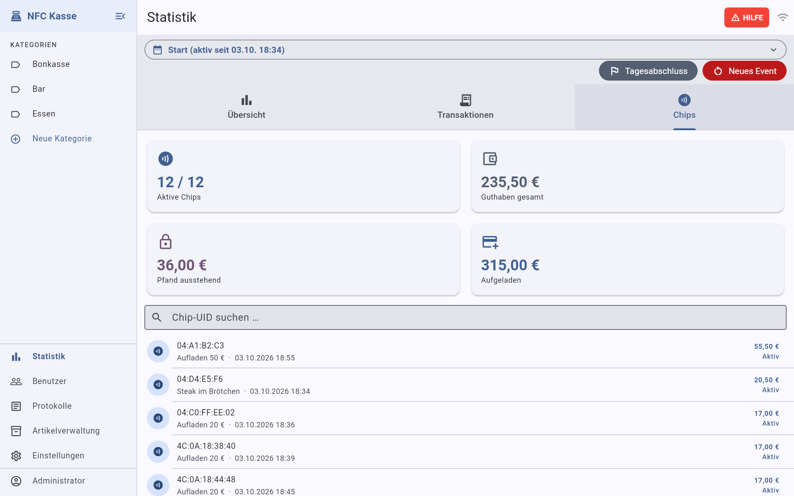

| Kachel | Bedeutung |
| --- | --- |
| Aktive Chips | Chips, die gerade ausgegeben sind, von allen bisher benutzten |
| Guthaben gesamt | Summe aller Guthaben, die noch auf Chips stehen. So viel Bargeld muss für Auszahlungen bereitliegen. |
| Pfand ausstehend | Pfand für alle ausgegebenen Chips, der bei Rückgabe erstattet wird |
| Aufgeladen | Summe aller Aufladungen im Zeitraum |

Darunter steht jeder Chip mit Nummer, letzter Buchung, Guthaben und Status: **Aktiv** (beim Gast) oder **Frei** (ausgezahlt). Mit **Chip-UID suchen** finden Sie einen bestimmten Chip.

Für den Kassensturz an der Bonkasse zeigt **Aufgeladen**, wie viel Bargeld im Zeitraum für Aufladungen eingenommen wurde. Ein Export der Daten als Datei ist im Server vorgesehen, hat in der App aber noch keinen Knopf.

## 11. Tagesabschluss und Neues Event

Beide Knöpfe stehen oben in der **Statistik** und brauchen das Recht **Umsatz einsehen**.

|  | Tagesabschluss | Neues Event |
| --- | --- | --- |
| Wann | am Ende jedes Veranstaltungstags | wenn die ganze Veranstaltung vorbei ist und die Chips für die nächste wieder ausgegeben werden |
| Was passiert | Die aktuelle Periode endet, eine neue beginnt | Tagesabschluss plus: Alle Guthaben werden auf 0,00 € gesetzt, jeder Chip gilt wieder als neu |
| Guthaben der Gäste | bleiben erhalten | sind weg |
| Artikel, Benutzer, Buchungsverlauf | bleiben | bleiben |

### 11.1 Tagesabschluss machen

1. In der Seitenleiste **Statistik** öffnen.
2. Oben rechts auf **Tagesabschluss** tippen.
3. Bei **Bezeichnung der neuen Periode** steht schon Datum und Uhrzeit. Sie können einen eigenen Namen eintragen, zum Beispiel „Samstag“.
4. **Abschließen** tippen.

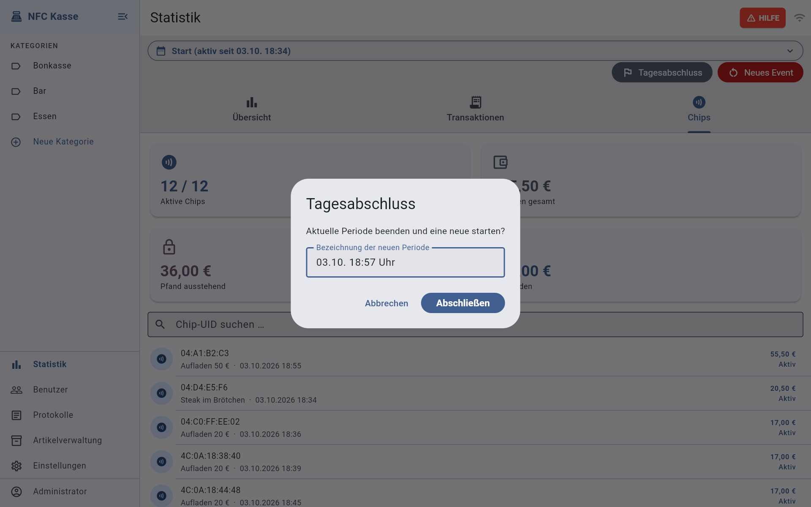

Danach zählt die Statistik ab null für die neue Periode. Den abgeschlossenen Tag sehen Sie jederzeit wieder, indem Sie ihn oben im Zeitraum auswählen (Abschnitt 10.1). Der Tagesabschluss unterbricht den Verkauf nicht.

Tipp: Starten Sie nach den Tests vor der Veranstaltung einmal **Neues Event** (Abschnitt 11.2). Dann haben die Testchips kein Guthaben mehr, und die Testbuchungen stehen nicht in den Zahlen des ersten Tages.

### 11.2 Neues Event starten

**Achtung:** Neues Event löscht alle Guthaben auf allen Chips. Vorher müssen alle Gäste ausgezahlt sein. Prüfen Sie in der Statistik im Reiter **Chips**, ob **Guthaben gesamt** bei 0,00 € steht oder nur noch Restbeträge offen sind, die Sie bewusst verfallen lassen.

1. In der **Statistik** oben rechts auf **Neues Event** tippen.
2. Die Warnung lesen: Alle Guthaben werden auf 0,00 € gesetzt, alle Chips gelten beim nächsten Scan als neue Kunden und der Pfand wird wieder erhoben.
3. Bei **Bezeichnung der neuen Periode** einen Namen eintragen, zum Beispiel den Namen der nächsten Veranstaltung.
4. **Zurücksetzen** tippen. Die Meldung „Alle Chips zurückgesetzt — bereit für neues Event.“ erscheint.

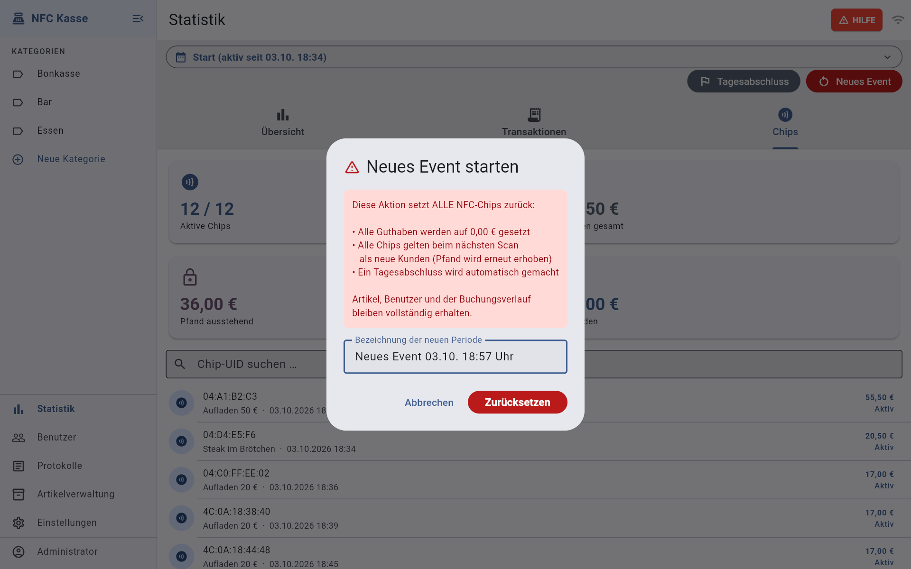

Artikel, Benutzer und der ganze Buchungsverlauf bleiben erhalten. Auch die Punkte des Leaderboards werden nicht zurückgesetzt. Den Namen der Veranstaltung auf Bons und in der Kasse ändern Sie im Verwaltungstool (Abschnitt 3.3).

Sichern Sie die Daten vor dem Neuen Event: Im Verwaltungstool auf dem Dashboard **Neu starten** klicken. Dabei legt NFC-Kasse automatisch eine Sicherung an. Mehr dazu im Handbuch für Systemadministratoren, Abschnitt 10.

## 12. Ansicht, Kundenanzeige und Kiosk

### 12.1 Ansicht anpassen

Unter **Einstellungen → Design** passen Sie die Kasse an das Gerät an. Die Einstellungen gelten nur für dieses Gerät.

- **Voreinstellungen**: **Klein**, **Standard** oder **Groß** setzt alles auf einmal.
- **Allgemein → Schriftgröße**: Schrift der ganzen Kasse.
- **Produktbereich → Spalten**: wie viele Kacheln nebeneinander stehen. **Button-Textzeilen**: wie viele Zeilen ein langer Artikelname auf der Kachel bekommt.
- **Warenkorb → Schriftgröße**: Schrift im Warenkorb.

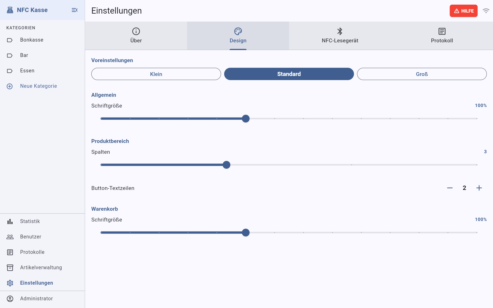

Außerdem lässt sich in der Kasse der Trennbalken zwischen Kacheln und Warenkorb mit dem Finger verschieben, und die Seitenleiste auf dem Tablet mit dem Symbol neben „NFC Kasse“ einklappen. Wie Sie die Reihenfolge der Kacheln ändern, steht in Abschnitt 5.5.

### 12.2 Eigenes Konto und Abmelden

Unten in der Seitenleiste steht der Name des angemeldeten Benutzers. Antippen öffnet die Kontoseite, dort ist **Abmelden**. Abmelden geht auch unter **Einstellungen → Über**.

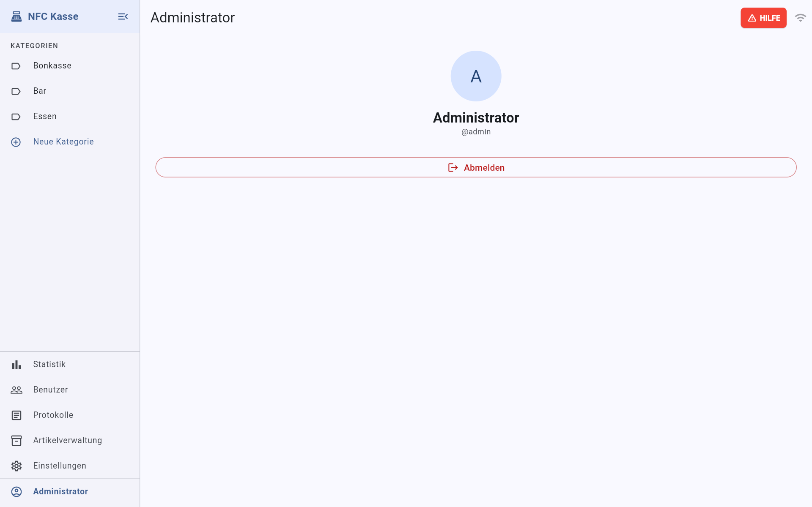

### 12.3 Kundenanzeige

Die Kundenanzeige zeigt dem Gast auf einem zweiten Bildschirm, was im Warenkorb liegt, sein Guthaben und was nach der Buchung übrig bleibt. Dafür eignet sich ein altes Tablet oder ein Monitor mit Browser, der zum Gast zeigt.

1. Am zweiten Bildschirm im Browser `http://nfc-kasse.lan:8000/display` öffnen.
2. Unter **Standsauswahl** erscheinen alle Kassen, an denen gerade jemand angemeldet ist, mit dem Namen des Kontos. Die richtige Kasse antippen.
3. Ab jetzt zeigt der Bildschirm live den Warenkorb dieser Kasse mit **Gesamt**, **Aktuelles Guthaben** und **Nach Buchung**.

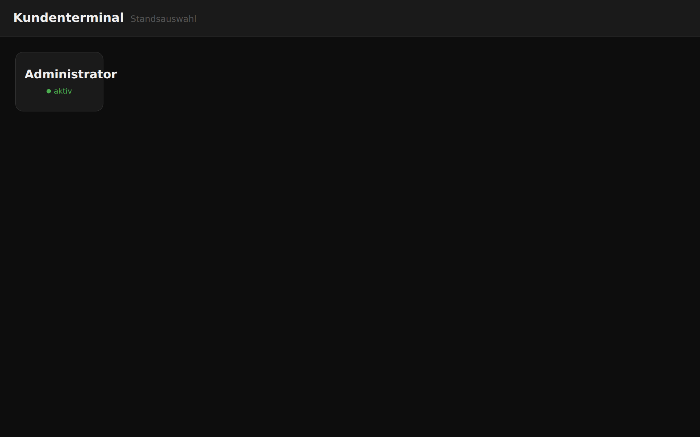

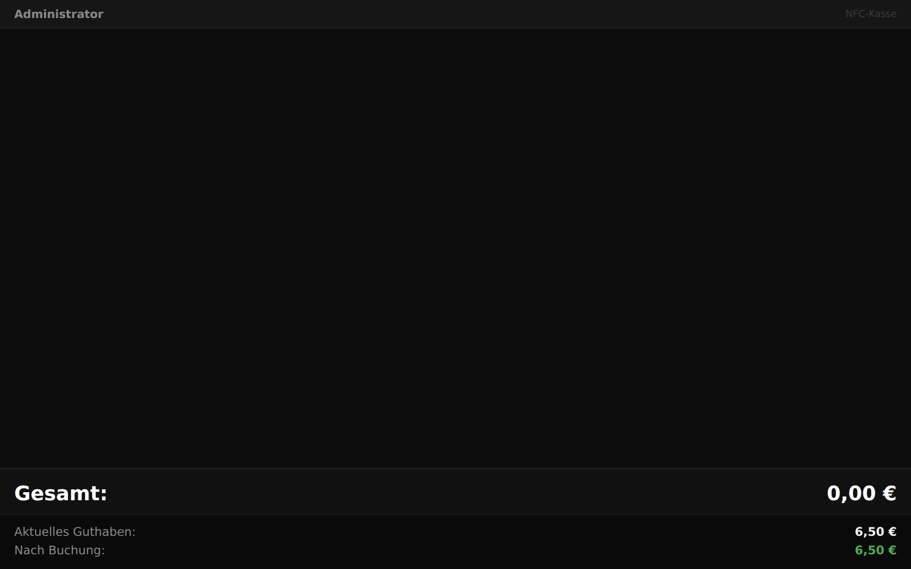

### 12.4 Kiosk für Gäste

An einem Kiosk-Gerät prüfen Gäste selbst ihr Guthaben, zum Beispiel neben der Bonkasse. Das Gerät kann nichts buchen.

1. Ein Konto anlegen, das nur die globale Berechtigung **Kiosk-Modus** hat (Abschnitt 6.2), zum Beispiel „kiosk“.
2. Am Kiosk-Gerät mit diesem Konto anmelden und, falls nötig, einen Bluetooth-Leser koppeln (Abschnitt 7).
3. Die Kasse zeigt jetzt nur noch das Kiosk-Bild und wartet auf einen Chip.
4. Hält ein Gast seinen Chip an den Leser, sieht er sein **Aktuelles Guthaben** und seine Buchungen. Mit **Fertig** oder nach kurzer Zeit kehrt das Gerät von selbst zum Startbild zurück.

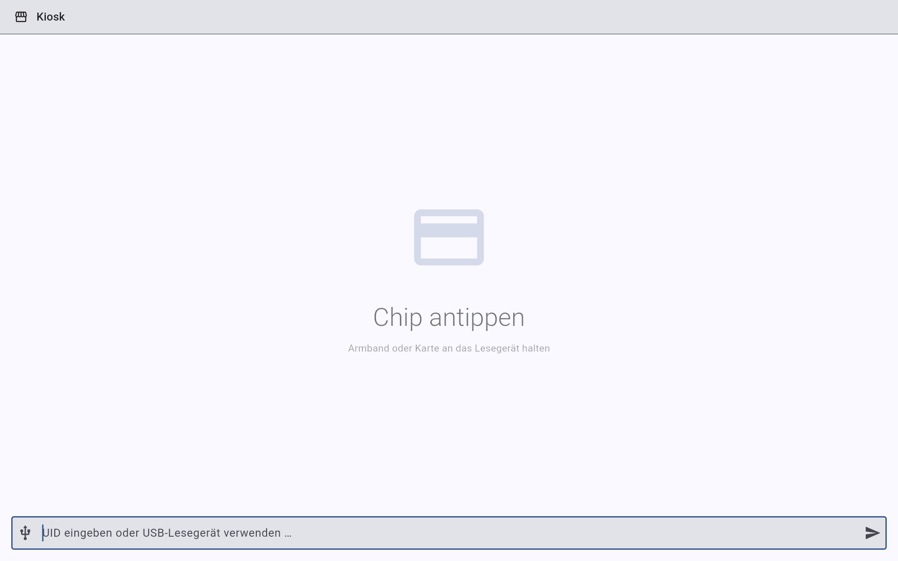

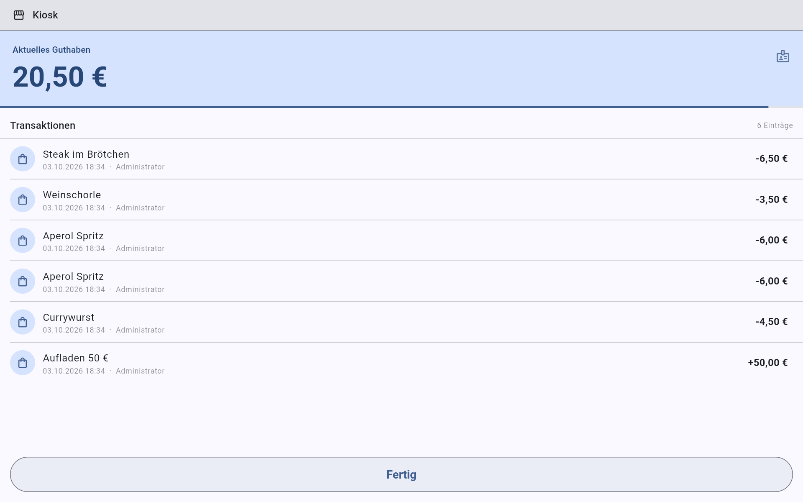

Abmelden: Oben links fünfmal schnell hintereinander auf das Laden-Symbol neben „Kiosk“ tippen. So können Gäste das Gerät nicht versehentlich verlassen.

## 13. Checkliste und Fehlerhilfe

### 13.1 Checkliste vor der Veranstaltung

- Router eingerichtet, der Server-Laptop hat die Adresse 192.168.1.2, `http://nfc-kasse.lan:8000` öffnet die Kasse (Handbuch für Systemadministratoren)
- Energiesparen und Ruhezustand am Server-Laptop ausgeschaltet (Handbuch für Systemadministratoren, Abschnitt 4)
- NFC-Kasse installiert, im Verwaltungstool steht „Läuft“
- Admin-Passwort geändert
- Name der Veranstaltung und Chip-Pfand im Verwaltungstool eingetragen
- Kategorien, Artikel und Preise angelegt, in der Bonkasse Aufladeartikel und ein Auszahlungs-Artikel
- Konten für alle Mitarbeiter mit ihren Kategorien, mindestens ein Notfall-Kontakt
- Jedes Tablet: App installiert, angemeldet, die richtigen Kategorien erscheinen
- NFC-Leser geladen und gekoppelt, Lesernummer auf dem Tablet notiert
- Bondrucker: Testbon gedruckt (falls genutzt)
- Testlauf: aufladen, verkaufen, stornieren, auszahlen
- Danach **Neues Event** gestartet, damit keine Testdaten übrig sind
- Server-Laptop einmal neu gestartet, der Dienst läuft danach von selbst
- Ladegeräte für Tablets und Leser, Wechselgeld und Bargeld für Auszahlungen bereit

### 13.2 Schnelle Hilfe

| Problem | Lösung |
| --- | --- |
| Das Symbol oben rechts zeigt keine Verbindung zum Server | Ist das Gerät im WLAN der Kasse? Stimmt die Server-URL samt `:8000`? Im Verwaltungstool prüfen, ob der Dienst läuft, sonst **Starten**. |
| Mit `nfc-kasse.lan` klappt die Anmeldung nicht | Auf der Anmeldeseite `http://192.168.1.2:8000` wählen. Den Router prüft das Handbuch für Systemadministratoren. |
| Nach dem Speichern im Verwaltungstool steht der Dienst auf „Gestoppt“ | Den zuletzt geänderten Wert prüfen, oft ein Komma statt Punkt im Chip-Pfand. Korrigieren und **Speichern & Dienst neu starten**. |
| Eine Änderung im Verwaltungstool wirkt nicht | **Speichern & Dienst neu starten** benutzen, beim Bon-Layout danach **Neu starten**. |
| „Nach Geräten suchen“ findet den Leser nicht | Leser eingeschaltet und geladen? Bluetooth am Gerät an? Im Browser: Chrome oder Edge, Adresse als vertrauenswürdig eingetragen (Abschnitt 7.3)? |
| Leser zeigt „Verbunden“, aber nichts passiert | Leser aus- und wieder einschalten, die App verbindet sich von selbst neu. Im Browser kann es bis zu 90 Sekunden dauern. |
| USB-Leser tippt, aber nichts passiert | Zuerst ins Chip-Feld tippen. |
| Android erkennt den Chip nicht | NFC in den Android-Einstellungen einschalten, Schutzhülle abnehmen, Chip 1 bis 2 Sekunden ruhig halten. |
| Buchen ist grau | Chip scannen. Ist Rest Guthaben rot, reicht das Guthaben nicht (Abschnitt 9.2). |
| „Doppelbuchung verhindert — bitte 2 Sekunden warten“ | Dieselbe Buchung wurde zweimal getippt. Kurz warten und am Guthaben prüfen, ob die erste durchgegangen ist. |
| „Storno-Zeitfenster von 5 Minuten abgelaufen“ | Die Schichtleitung holen (Abschnitt 9.5). |
| „Keine Buchungsberechtigung für eine oder mehrere Warengruppen“ oder leere Seitenleiste | Dem Konto unter **Benutzer** die Kategorie mit **Buchen** geben (Abschnitt 6.3). |
| Bons werden nicht gedruckt | Abschnitt 8.7. |
| Alle Geräte wurden abgemeldet | Einfach neu anmelden. Passiert, wenn die Einstellungsdatei des Servers neu angelegt wurde. |

Detaillierte Fehlersuche steht im Handbuch für Systemadministratoren, Abschnitt 12. Kommen Sie nicht weiter, schreiben Sie an **kontakt@nfc-kasse.de** und hängen Sie die Protokolle aus `C:\ProgramData\NFC-Kasse\logs\` an (Verwaltungstool → Dashboard → **Protokolle öffnen**).
