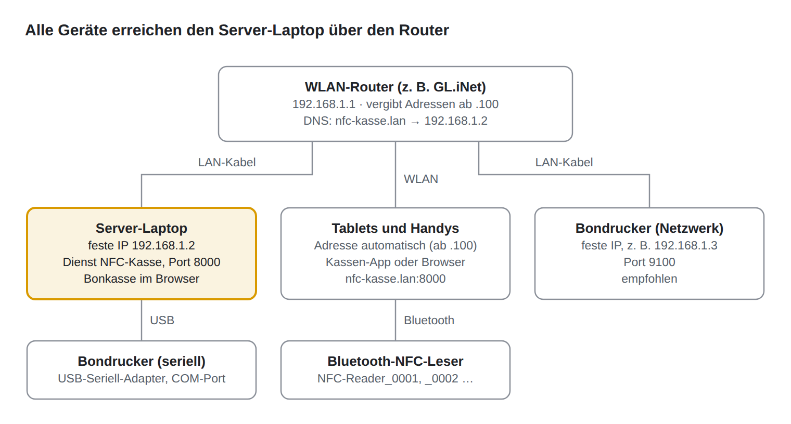
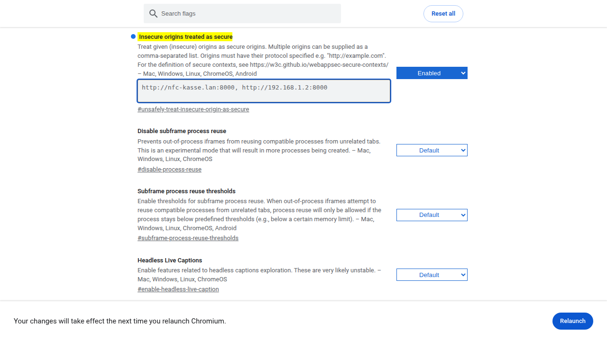

# NFC-Kasse – Handbuch für Systemadministratoren

4. Oktober 2026 · Kim Schehl

## 1. Überblick

Dieses Handbuch ist für die Person, die das Kassensystem aufbaut und betreut. Es ergänzt die Bedieneranleitung um die technischen Details: Netzwerk, Windows-Dienst, Konfigurationsdateien, Datensicherung und Fehlersuche.

NFC-Kasse läuft komplett im eigenen Netz, ohne Internet. Ein Windows-Laptop ist der Server. Meist steht er an der Bonkasse und ist dort gleichzeitig Kasse. Alle Tablets, Handys und Anzeigen verbinden sich über den WLAN-Router mit ihm.



Der Bondrucker hängt entweder per Kabel am Server-Laptop (seriell) oder als eigenes Gerät im Netz. Die Netzwerk-Variante ist empfohlen, weil der Drucker dann nicht neben dem Laptop stehen muss.

### Feste Adressen

| Gerät | Adresse | Festgelegt durch |
| --- | --- | --- |
| Router | 192.168.1.1 | LAN-Einstellung im Router |
| Server-Laptop | 192.168.1.2 | IP-Reservierung im Router (Abschnitt 2) |
| Netzwerk-Bondrucker | z. B. 192.168.1.3 | IP-Reservierung im Router |
| Tablets, Handys, Anzeigen | automatisch ab 192.168.1.100 | DHCP des Routers |

Der Name **nfc-kasse.lan** zeigt auf 192.168.1.2. Er wird im Router eingetragen (Abschnitt 2). Ohne diesen Eintrag funktioniert alles auch mit der IP-Adresse. Dann steht überall 192.168.1.2 statt nfc-kasse.lan.

### Adressen im Browser

Alle Seiten laufen auf Port 8000.

| Adresse | Wofür | Anmeldung |
| --- | --- | --- |
| http://nfc-kasse.lan:8000/webapp | Kassen-App im Browser | ja |
| http://localhost:8000/webapp | dasselbe, direkt am Server-Laptop | ja |
| http://nfc-kasse.lan:8000/display | Kundenanzeige für eine Kasse | nein |
| http://nfc-kasse.lan:8000/leaderboard | Bestenliste (nur mit Lizenz) | nein |
| http://nfc-kasse.lan:8000/download | Android-App (APK) herunterladen | nein |
| http://nfc-kasse.lan:8000/health | Schnelltest, antwortet mit `{"status":"ok"}` | nein |
| http://nfc-kasse.lan:8000/docs | technische API-Übersicht | nein |

Nicht verwechseln: Das Windows-Setup gibt es im Internet unter **nfc-kasse.de/download**. Die Adresse **/download** auf dem eigenen Server liefert nur die Android-App aus.

## 2. Router einrichten (GL.iNet mit LuCI)

Als Referenz dient ein GL.iNet-Router. Darauf läuft OpenWrt, die erweiterte Oberfläche heißt LuCI. Mit anderen Routern geht es genauso, nur die Menüs heißen anders. Gesucht sind immer eine **IP-Reservierung** (auch „statische DHCP-Zuweisung“) und ein **lokaler DNS-Eintrag**.

Der Router braucht für den Betrieb kein Internet. Nur das einmalige Nachinstallieren von LuCI (Schritt 2.1) kann eine Internetverbindung benötigen.

Sie brauchen: den Router, den Server-Laptop, ein Netzwerkkabel und das Admin-Passwort des Routers. Die Menüs in LuCI sind meist englisch, deshalb stehen sie hier auch so.

### 2.1 LuCI öffnen

1. Verbinden Sie den Laptop per Kabel mit einem LAN-Anschluss des Routers.
2. Öffnen Sie im Browser die Adresse des Routers. Ab Werk ist das **http://192.168.8.1**, nach Schritt 2.2 **http://192.168.1.1**.
3. Melden Sie sich mit dem Admin-Passwort an.
4. Wählen Sie links **SYSTEM → Advanced Settings** und dort **Go To LuCI**. Bietet die Seite stattdessen an, LuCI zu installieren, tun Sie das zuerst.
5. Melden Sie sich in LuCI an: Benutzer **root**, Passwort wie in der GL.iNet-Oberfläche.

### 2.2 Router-Adresse auf 192.168.1.1 stellen

GL.iNet-Router haben ab Werk die Adresse 192.168.8.1. Damit alle Adressen in den Anleitungen passen, stellen Sie das Netz auf 192.168.1.x um. Ist Ihr Router schon auf 192.168.1.1, überspringen Sie diesen Schritt.

1. In LuCI **Network → Interfaces** öffnen und in der Zeile **lan** auf **Edit** klicken.
2. Im Reiter **General Settings**: **IPv4 address** auf `192.168.1.1`, **IPv4 netmask** auf `255.255.255.0`.
3. Im Reiter **DHCP Server** prüfen: **Start** `100`, **Limit** `150`. Der Router vergibt dann automatisch die Adressen 192.168.1.100 bis .249. Die Adressen .2 und .3 bleiben frei für Server und Drucker.
4. **Save**, danach oben **Save & Apply**.
5. LuCI warnt, dass der Router nach der Änderung nicht mehr erreichbar sein könnte. Wählen Sie **Apply unchecked**. Sonst nimmt der Router die Änderung nach 90 Sekunden selbst zurück.
6. Ziehen Sie das Netzwerkkabel kurz ab und stecken Sie es wieder ein. LuCI ist jetzt unter **http://192.168.1.1/cgi-bin/luci** erreichbar.

### 2.3 Feste Adresse für den Server-Laptop (IP-Reservierung)

Der Router gibt dem Laptop dann immer 192.168.1.2. Der Laptop selbst bleibt auf „IP-Adresse automatisch beziehen“.

1. Laptop mit dem Router verbinden, am besten per Kabel. So taucht er in der Geräteliste auf.
2. In LuCI **Network → DHCP and DNS** öffnen, Reiter **Static Leases**, dann **Add**.
3. **Hostname**: `nfc-kasse`.
4. **MAC address**: den Laptop aus der Liste wählen. Steht er nicht drin, die Adresse eintippen. Sie steht am Laptop in der Eingabeaufforderung unter `ipconfig /all` als „Physische Adresse“ des Adapters, mit dem er verbunden ist.
5. **IPv4 address**: `192.168.1.2`.
6. **Save**, danach **Save & Apply**.
7. Am Laptop das Kabel kurz ab- und wieder anstecken. In der Eingabeaufforderung zeigt `ipconfig` jetzt die IPv4-Adresse 192.168.1.2.

Wichtig: Die Reservierung hängt an der MAC-Adresse. Kabel und WLAN haben verschiedene MAC-Adressen. Reservieren Sie die des Anschlusses, den der Laptop bei der Veranstaltung nutzt. Läuft er doch über WLAN, schalten Sie unter **Einstellungen → Netzwerk und Internet → WLAN → (Ihr Netz)** die Option **Zufällige Hardwareadressen** aus. Sonst passt die Reservierung nicht.

Einen Netzwerk-Bondrucker reservieren Sie genauso, zum Beispiel mit Hostname `bondrucker` und `192.168.1.3`.

### 2.4 Name nfc-kasse.lan eintragen (DNS)

Mit diesem Eintrag beantwortet der Router die Frage „Wo ist nfc-kasse.lan?“ mit 192.168.1.2. Alle Geräte im Netz können dann den Namen statt der Zahl verwenden.

1. In LuCI **Network → DHCP and DNS** öffnen, Reiter **Hostnames**, dann **Add**. In älteren LuCI-Versionen ist das ein eigener Menüpunkt **Network → Hostnames**.
2. **Hostname**: `nfc-kasse.lan`.
3. **IP address**: `192.168.1.2`.
4. **Save**, danach **Save & Apply**.

### 2.5 Prüfen

Am Laptop oder einem anderen Windows-PC im selben Netz in der Eingabeaufforderung:

```
nslookup nfc-kasse.lan
ping nfc-kasse.lan
```

Beide müssen 192.168.1.2 nennen. Dann auf einem Tablet im Browser **http://nfc-kasse.lan:8000/health** öffnen. Erscheint eine Zeile mit `"status":"ok"`, ist Netzwerk und Server in Ordnung. Dafür muss die NFC-Kasse schon installiert sein (Abschnitt 5).

### 2.6 WLAN für die Kasse

- Geben Sie dem WLAN einen eigenen Namen, zum Beispiel „NFC-Kasse“, und ein sicheres Passwort (WPA2 oder WPA3).
- Verbinden Sie Kassengeräte nie mit einem Gäste-WLAN. Dort sind die Geräte voneinander abgeschirmt und erreichen den Server nicht.
- Lassen Sie Gäste nicht in das Kassen-WLAN.

## 3. Ohne eigenen Router

Am einfachsten bringen Sie den eigenen, fertig eingerichteten Router mit. Die Kasse braucht kein Internet, er kann also allein stehen. Geht das nicht, etwa weil in der Halle nur ein fremder Router steht, an dem Sie nichts einstellen dürfen, gibt es drei Wege.

### 3.1 Feste IP direkt am Laptop

Das geht nur, wenn das fremde Netz Adressen der Form 192.168.1.x nutzt und die .2 frei ist. Fragen Sie den Betreiber, welche Adressen der Router selbst vergibt. Die feste Adresse muss außerhalb dieses Bereichs liegen, sonst bekommen zwei Geräte dieselbe Adresse.

1. Am Laptop **Einstellungen → Netzwerk und Internet → Ethernet** öffnen (bei WLAN: das verbundene Netz → **Eigenschaften**).
2. Bei **IP-Zuweisung** auf **Bearbeiten**, dann **Manuell** wählen und **IPv4** einschalten.
3. Eintragen: IP-Adresse `192.168.1.2`, Subnetzmaske `255.255.255.0`, Gateway `192.168.1.1`, Bevorzugter DNS `192.168.1.1`.
4. **Speichern**.

Hat das fremde Netz andere Adressen, zum Beispiel 192.168.178.x bei einer FRITZ!Box, nehmen Sie eine freie Adresse aus diesem Netz. Dann gilt in allen Anleitungen diese Adresse statt 192.168.1.2.

### 3.2 Nur mit der IP-Adresse arbeiten

Ohne DNS-Eintrag kennt niemand den Namen nfc-kasse.lan. Das ist kein Problem:

- In der App auf dem Anmeldebildschirm bei **Server** die Adresse `http://192.168.1.2:8000` wählen. Die App bietet sie schon in der Liste an.
- Im Browser überall `http://192.168.1.2:8000/…` statt `http://nfc-kasse.lan:8000/…` verwenden.
- Am Server-Laptop selbst geht immer `http://localhost:8000/webapp`.
- Für Bluetooth im Browser auf weiteren Windows-PCs muss die IP-Adresse in die Browser-Richtlinie (Abschnitt 8).

### 3.3 hosts-Datei (nur Windows-PCs)

Einzelnen Windows-PCs können Sie den Namen auch ohne Router beibringen. Android-Geräte können das nicht, dort bleibt es bei der IP-Adresse.

1. **Editor** über das Startmenü mit Rechtsklick **Als Administrator ausführen**.
2. Die Datei `C:\Windows\System32\drivers\etc\hosts` öffnen (Dateityp „Alle Dateien“ wählen).
3. Am Ende diese Zeile anfügen und speichern:

```
192.168.1.2    nfc-kasse.lan
```

## 4. Server-Laptop vorbereiten

Voraussetzung ist ein Windows 10 oder 11 in 64 Bit und ein Konto mit Administratorrechten. Fällt der Laptop während der Veranstaltung aus, stehen alle Kassen. Die folgenden Einstellungen verhindern das.

### 4.1 Nie schlafen lassen

1. Laptop immer am Netzteil betreiben.
2. **Einstellungen → System → Netzbetrieb und Akku → Bildschirm, Standbymodus und Ruhezustand**: bei Netzbetrieb den Standbymodus auf **Nie**. Der Bildschirm darf ausgehen.
3. **Systemsteuerung → Energieoptionen → Auswählen, was beim Zuklappen des Computers geschehen soll**: bei Netzbetrieb **Nichts unternehmen**.
4. Nur bei seriellem Bondrucker: **Energieoptionen → Energiesparplaneinstellungen ändern → Erweiterte Energieeinstellungen ändern → USB-Einstellungen → Einstellung für selektives USB-Energiesparen** auf **Deaktiviert**.

Schneller geht es in einer Eingabeaufforderung als Administrator:

```
powercfg /change standby-timeout-ac 0
powercfg /change hibernate-timeout-ac 0
powercfg /setacvalueindex SCHEME_CURRENT SUB_BUTTONS LIDACTION 0
powercfg /setactive SCHEME_CURRENT
```

### 4.2 Windows Update im Griff behalten

Windows startet nach Updates gern von selbst neu. Der Kassendienst startet danach zwar automatisch wieder, die Kassen stehen aber für einige Minuten.

- Installieren Sie Updates einige Tage vor der Veranstaltung.
- Am Veranstaltungstag unter **Einstellungen → Windows Update** auf **Updates pausieren**.

### 4.3 Netzwerk, Bluetooth und Uhrzeit

- Verbinden Sie den Laptop per Kabel mit dem Router. Das ist stabiler als WLAN.
- Schalten Sie Bluetooth ein, wenn an der Bonkasse ein Bluetooth-NFC-Leser im Browser genutzt wird.
- Prüfen Sie Uhrzeit und Zeitzone. Ohne Internet stellt Windows die Uhr nicht selbst. Buchungen, Bons und die Statistik nutzen die Uhrzeit des Laptops.
- Andere Programme, die Port 8000 belegen, dürfen nicht laufen. Sonst startet der Kassendienst nicht.

## 5. Installation, Windows-Dienst und Verwaltungstool

### 5.1 Installieren

1. Laden Sie **NFC-Kasse-Setup.exe** von **nfc-kasse.de/download** herunter.
2. Doppelklicken Sie die Datei und bestätigen Sie die Benutzerkontensteuerung mit **Ja**.
3. Meldet Windows „Der Computer wurde durch Windows geschützt“, klicken Sie auf **Weitere Informationen** und dann **Trotzdem ausführen**.
4. Auf der Seite **Installationsmodus** ist **Installieren** schon gewählt. Ist die Kasse bereits installiert, steht dort **Aktualisieren** (Abschnitt 11).
5. Zielordner so lassen (`C:\Program Files\NFC-Kasse`). Auf Wunsch **Desktop-Symbol erstellen** anhaken.
6. **Installieren**. Das Setup richtet den Dienst ein, startet ihn und öffnet am Ende mit **NFC-Kasse jetzt öffnen** die Kasse im Browser.
7. Melden Sie sich mit **admin** / **admin** an und ändern Sie das Passwort sofort: Menü **Benutzer**, beim Administrator auf den Stift tippen, Feld **Neues Passwort**.

### 5.2 Was das Setup einrichtet

| Was | Wo / Name | Hinweis |
| --- | --- | --- |
| Programm | `C:\Program Files\NFC-Kasse\` | inkl. `NfcKasseService.exe` (Dienst-Steuerung) und `Verwaltung\NfcKasseAdmin.exe` |
| Daten | `C:\ProgramData\NFC-Kasse\` | entsteht beim ersten Start des Dienstes (Abschnitt 6) |
| Windows-Dienst | Anzeigename **NFC-Kasse Backend**, Dienstname `NfcKasseBackend` | startet automatisch mit Windows, läuft als LocalSystem |
| Firewall-Regel | **NFC-Kasse Backend** | erlaubt eingehende Verbindungen zum Programm, alle Netzwerkprofile |
| Browser-Richtlinien | Edge und Chrome | erlauben Bluetooth auf localhost und nfc-kasse.lan (Abschnitt 8) |
| Startmenü | Ordner **NFC-Kasse** | NFC-Kasse öffnen, Dienst starten, Dienst stoppen, NFC-Kasse Verwaltung |

### 5.3 Das Verwaltungstool

Öffnen Sie im Startmenü **NFC-Kasse → NFC-Kasse Verwaltung** und bestätigen Sie die Benutzerkontensteuerung. Das Tool hat links vier Seiten.

**Dashboard** zeigt, ob der Dienst läuft (grüner Punkt, „Läuft“). Darunter: **Starten**, **Stoppen**, **Neu starten**. **Weboberfläche öffnen** öffnet die Kasse am Laptop, **Protokolle öffnen** den Ordner mit den Protokolldateien.


**Konfiguration** bearbeitet die Datei `config.env` (alle Felder in Abschnitt 7). Unten stehen zwei Knöpfe: **Speichern** schreibt nur die Datei. **Speichern & Dienst neu starten** schreibt und startet den Dienst neu, erst dann gelten die Änderungen.


**Bon-Layout** bearbeitet die Datei `bon.yaml` (Abschnitt 9). Hier gibt es nur **Speichern**. Starten Sie danach auf dem Dashboard den Dienst neu.


**Info** zeigt Version, Installations-ID und die Ordner. Die Symbole rechts kopieren den jeweiligen Wert.


Jeder Neustart unterbricht alle Kassen für einige Sekunden und legt eine Datensicherung an. Starten Sie nicht während des größten Andrangs neu.

### 5.4 Dienst ohne Verwaltungstool steuern

In **Dienste** (`services.msc`) steht der Dienst als **NFC-Kasse Backend**. In einer Eingabeaufforderung als Administrator:

```
"C:\Program Files\NFC-Kasse\NfcKasseService.exe" status
"C:\Program Files\NFC-Kasse\NfcKasseService.exe" restart
sc query NfcKasseBackend
```

Stürzt der Dienst ab, startet Windows ihn nach 10 Sekunden neu, bei jedem weiteren Absturz nach 30 Sekunden. Nach einer Stunde ohne Absturz zählt Windows wieder von vorn.

## 6. Ordner, Dateien und Protokolle

Alles, was die Kasse speichert, liegt in \*\*C:\\ProgramData\\NFC-Kasse\*\*. Der Ordner ist in Windows versteckt. Tippen Sie den Pfad direkt in die Adresszeile des Explorers oder nutzen Sie im Verwaltungstool die Seite **Info**.

| Datei oder Ordner | Inhalt |
| --- | --- |
| `config.env` | alle Einstellungen (Abschnitt 7) |
| `bon.yaml` | Bon-Layout (Abschnitt 9) |
| `kasse.db` mit `kasse.db-wal` und `kasse.db-shm` | die Datenbank: Benutzer, Artikel, Chips, Guthaben, Buchungen |
| `backups\kasse_JJJJMMTT-HHMM.db` | Sicherung bei jedem Dienststart, die fünf neuesten bleiben (Abschnitt 10) |
| `logs\kasse_JJJJ-MM-TT_HH.log` | Protokoll der Kasse, eine Datei pro Stunde, aufbewahrt für 7 Tage |
| `logs\winsw\` | Protokoll des Dienst-Rahmens. Hier stehen Fehler, die schon beim Start passieren, etwa eine fehlerhafte `config.env`. |

`config.env` und `bon.yaml` entstehen beim ersten Start des Dienstes aus einer Vorlage. Danach überschreibt die Kasse sie nie wieder, auch nicht bei einem Update.

Im Programmordner `C:\Program Files\NFC-Kasse\` ändern Sie nichts. Ein Update ersetzt ihn komplett.

### Protokolle lesen

Die Protokolldateien enthalten eine Zeile pro Ereignis. Bequemer geht es in der App: Menü **Protokolle** zeigt sie mit Filter. Wie ausführlich protokolliert wird, stellen Sie in der App unter **Einstellungen → Protokoll** ein, ohne Neustart. `LOG_LEVEL` in `config.env` gilt nur für den Start.

## 7. config.env: alle Einstellungen

Die Datei liegt in `C:\ProgramData\NFC-Kasse\config.env`. Am einfachsten bearbeiten Sie sie im Verwaltungstool auf der Seite **Konfiguration**. Von Hand geht es mit dem Editor (als Administrator). Jede Zeile hat die Form `NAME=Wert`, Zeilen mit `#` sind Kommentare. Änderungen gelten erst nach einem Neustart des Dienstes.

| Name | Feld im Verwaltungstool | Standard | Bedeutung |
| --- | --- | --- | --- |
| `HOST` | Netzwerkschnittstelle (HOST) | `0.0.0.0` | `0.0.0.0` = aus dem ganzen Netz erreichbar. `127.0.0.1` = nur am Laptop selbst. |
| `PORT` | Port | `8000` | Nicht ändern. Alle Adressen, die App-Voreinstellungen und die Browser-Richtlinien setzen 8000 voraus. |
| `SECRET_KEY` | (nicht angezeigt) | zufällig | Schlüssel für die Anmeldungen. Eine Änderung meldet alle Geräte ab. |
| `INSTALLATION_ID` | Seite Info | zufällig | Kennung dieser Installation. Nie ändern, alle Lizenzschlüssel hängen daran. |
| `EVENT_NAME` | Name der Veranstaltung | `Hauptveranstaltung` | erscheint in der App und auf den Bons |
| `CHIP_DEPOSIT` | Chip-Pfand (€) | `3.00` | Pfand je Chip in Euro. `0` schaltet das Pfand ab. |
| `BAR_CHIP_UID` | Virtuelle Bar-Chip-UID | `BAR` | Kennung des virtuellen Chips für Barverkäufe an der Bonkasse. Sein Guthaben darf ins Minus gehen. |
| `LEADERBOARD` | Leaderboard aktiviert | `false` | Bestenliste, braucht zusätzlich den Lizenzschlüssel |
| `LEADERBOARD_LICENSE_KEY` | Leaderboard-Lizenzschlüssel | leer | Lizenz für diese Installation |
| `PAGER` | Pager aktiviert | `false` | Pager-Funktion, braucht zusätzlich den Lizenzschlüssel |
| `PAGER_LICENSE_KEY` | Pager-Lizenzschlüssel | leer | Lizenz für diese Installation |
| `WEBAPP_ROUTE` | Webapp-Pfad | `/webapp` | Nicht ändern, die Web-App ist für diesen Pfad gebaut. |
| `ALLOWED_ORIGINS` | Erlaubte Herkunfts-Adressen (CORS) | `http://localhost:8000,http://127.0.0.1:8000` | siehe unten |
| `LOG_LEVEL` | Protokoll-Level | `INFO` | `TRACE`, `DEBUG`, `INFO`, `WARNING`, `ERROR` oder `FATAL` |
| `PRINTER_TYPE` | Anschlussart | `serial` | `serial` oder `network` (Abschnitt 9) |
| `PRINTER_PORT` | COM-Port bzw. TCP-Port | `COM4` | seriell: z. B. `COM3`. Netzwerk: meist `9100`. |
| `PRINTER_BAUDRATE` | Baudrate | `9600` | nur seriell |
| `PRINTER_HOST` | Drucker-IP-Adresse | `192.168.1.100` | nur Netzwerk, z. B. `192.168.1.3` |
| `PRINTER_LINE_WIDTH` | Zeichen pro Zeile | `42` | 80-mm-Papier: 42. 58-mm-Papier: meist 32. |
| `PRINTER_AUTO_CUT` | Bon automatisch abschneiden | `true` | nur für Drucker mit Abschneider |
| `BON_SHOW_EVENT_NAME` | Veranstaltungsname anzeigen | `true` |  |
| `BON_SHOW_DATETIME` | Datum + Uhrzeit anzeigen | `true` |  |
| `BON_SHOW_PRICE` | Preis anzeigen | `true` |  |
| `BON_FOOTER_TEXT` | Fußzeilentext | leer | z. B. „Vielen Dank!“ |
| `BON_SHOW_CASHIER` | Kassierer anzeigen | `true` |  |
| `BON_CASHIER_LABEL` | Kassierer-Bezeichnung | `Kassierer` | Text vor dem Namen. Leer = nur der Name. |

### ALLOWED\_ORIGINS richtig setzen

Diese Liste betrifft nur die Kasse im Browser, nicht die Android-App. Der Browser blockiert die Anmeldung, wenn die Seite unter einer Adresse geöffnet wurde, auf dem Anmeldebildschirm aber eine andere als Server eingestellt ist. Beispiel: Seite über `http://192.168.1.2:8000/webapp` geöffnet, Server `http://nfc-kasse.lan:8000`. Damit beide Wege funktionieren, tragen Sie alle Adressen ein:

```
ALLOWED_ORIGINS=http://localhost:8000,http://127.0.0.1:8000,http://nfc-kasse.lan:8000,http://192.168.1.2:8000
```

## 8. Browser-Richtlinien für Bluetooth

Der Bluetooth-NFC-Leser funktioniert im Browser nur in Chrome und Edge, nicht in Firefox oder Safari. Diese Browser erlauben Bluetooth nur auf „sicheren“ Seiten, also HTTPS oder localhost. Die Kasse läuft im eigenen Netz über einfaches HTTP. Deshalb muss die Adresse der Kasse per Richtlinie als sicher eingetragen werden.

Auf Android-Geräten nutzen Sie statt des Browsers die Kassen-App. Dort ist nichts einzustellen.

### 8.1 Was das Setup auf dem Server-Laptop schon erledigt

Das Setup trägt für Edge und Chrome die Richtlinie **OverrideSecurityRestrictionsOnInsecureOrigin** ein, mit zwei Adressen:

| Wert | Adresse |
| --- | --- |
| `1` | `http://localhost:8000` |
| `2` | `http://nfc-kasse.lan:8000` |

Am Server-Laptop funktioniert Bluetooth also sofort, solange Sie die Kasse über eine dieser Adressen öffnen. Chrome zeigt danach „Wird von Ihrer Organisation verwaltet“. Das ist normal.

Arbeiten Sie nur mit der IP-Adresse, ergänzen Sie am Server-Laptop einen dritten Wert (Eingabeaufforderung als Administrator):

```
reg add "HKLM\SOFTWARE\Policies\Microsoft\Edge\OverrideSecurityRestrictionsOnInsecureOrigin" /v 3 /t REG_SZ /d "http://192.168.1.2:8000" /f
reg add "HKLM\SOFTWARE\Policies\Google\Chrome\OverrideSecurityRestrictionsOnInsecureOrigin" /v 3 /t REG_SZ /d "http://192.168.1.2:8000" /f
```

### 8.2 Weitere Windows-PCs

Soll ein weiterer PC die Kasse im Browser mit Bluetooth-Leser nutzen, tragen Sie die Richtlinie dort von Hand ein (Eingabeaufforderung als Administrator):

```
reg add "HKLM\SOFTWARE\Policies\Microsoft\Edge\OverrideSecurityRestrictionsOnInsecureOrigin" /v 1 /t REG_SZ /d "http://nfc-kasse.lan:8000" /f
reg add "HKLM\SOFTWARE\Policies\Microsoft\Edge\OverrideSecurityRestrictionsOnInsecureOrigin" /v 2 /t REG_SZ /d "http://192.168.1.2:8000" /f
reg add "HKLM\SOFTWARE\Policies\Google\Chrome\OverrideSecurityRestrictionsOnInsecureOrigin" /v 1 /t REG_SZ /d "http://nfc-kasse.lan:8000" /f
reg add "HKLM\SOFTWARE\Policies\Google\Chrome\OverrideSecurityRestrictionsOnInsecureOrigin" /v 2 /t REG_SZ /d "http://192.168.1.2:8000" /f
```

### 8.3 Prüfen

1. Browser komplett schließen und neu öffnen.
2. `edge://policy` bzw. `chrome://policy` aufrufen und auf **Richtlinien neu laden** klicken.
3. In der Liste muss **OverrideSecurityRestrictionsOnInsecureOrigin** mit den Adressen und dem Status **OK** stehen.

### 8.4 Ohne Administratorrechte: Browser-Flag

Geht keine Richtlinie, hilft eine Einstellung im Browser selbst. Sie gilt nur für dieses Browser-Profil.

1. `chrome://flags/#unsafely-treat-insecure-origin-as-secure` bzw. `edge://flags/#unsafely-treat-insecure-origin-as-secure` öffnen.
2. In das Textfeld `http://nfc-kasse.lan:8000,http://192.168.1.2:8000` eintragen.
3. Rechts auf **Enabled** stellen und unten **Relaunch** (Neu starten) klicken.



### 8.5 Bluetooth im Browser: was man wissen muss

- Der Leser wird nicht in den Windows-Einstellungen gekoppelt, sondern im Auswahlfenster des Browsers (Einstellungen der Kasse → **NFC-Lesegerät**).
- Nach jedem Neuladen der Seite muss der Leser im Auswahlfenster neu gewählt werden. Das ist eine Grenze des Browsers. Die Android-App verbindet sich dagegen von selbst wieder.
- Bluetooth muss in Windows eingeschaltet sein.

## 9. Bondrucker technisch

An der Bonkasse druckt die Kasse für jeden verkauften Artikel einen eigenen Bon, bei 3 × Bier also drei. Dafür eignen sich Thermo-Bondrucker mit dem Befehlssatz ESC/POS. Das können fast alle Bondrucker.

NFC-Kasse ist an kein bestimmtes Modell gebunden. Getestet wurde zum Beispiel der Epson TM-T88II (seriell). Empfohlen sind Drucker mit Netzwerkanschluss: Sie können überall im Netz stehen, und es gibt keine Probleme mit Treibern oder COM-Ports.

|  | Netzwerk (empfohlen) | Seriell |
| --- | --- | --- |
| Anschluss | LAN-Kabel zum Router | USB-Seriell-Adapter am Server-Laptop |
| Anschlussart im Verwaltungstool | `network` | `serial` |
| Einstellungen | Drucker-IP-Adresse, TCP-Port 9100 | COM-Port, Baudrate |
| Standort | beliebig im Netz | direkt am Server-Laptop |

Drucker mit reinem USB-Anschluss funktionieren nur, wenn ihr Treiber einen virtuellen COM-Port anlegt. Ein normaler Windows-Druckertreiber reicht nicht, die Kasse spricht den Drucker direkt an.

### 9.1 Netzwerkdrucker einrichten

1. Drucker per LAN-Kabel an den Router anschließen und einschalten.
2. Einen Selbsttest drucken. Bei den meisten Modellen hält man dazu die Vorschub-Taste beim Einschalten gedrückt. Der Ausdruck zeigt MAC- und IP-Adresse.
3. Im Router eine IP-Reservierung für diese MAC-Adresse anlegen, z. B. `192.168.1.3` (Abschnitt 2.3). Drucker aus- und wieder einschalten.
4. Manche Drucker haben ab Werk eine feste Adresse aus einem anderen Netz und fragen den Router gar nicht. Dann stellen Sie den Drucker mit dem Werkzeug des Herstellers auf „DHCP“ oder direkt auf `192.168.1.3` um.
5. Prüfen Sie die Verbindung am Server-Laptop in der PowerShell: `Test-NetConnection 192.168.1.3 -Port 9100`. Es muss `TcpTestSucceeded : True` erscheinen.
6. Im Verwaltungstool auf **Konfiguration → Bondrucker**: **Anschlussart** `network`, **TCP-Port** `9100`, **Drucker-IP-Adresse** `192.168.1.3`.
7. **Zeichen pro Zeile**: `42` bei 80 mm Papier, meist `32` bei 58 mm. **Bon automatisch abschneiden** nur einschalten, wenn der Drucker einen Abschneider hat.
8. **Speichern & Dienst neu starten**.

### 9.2 Seriellen Drucker einrichten

1. Drucker über den USB-Seriell-Adapter am Laptop anschließen und den Treiber des Adapters installieren.
2. Im **Geräte-Manager** unter **Anschlüsse (COM & LPT)** die Nummer ablesen, z. B. „USB-Serial Port (COM13)“.
3. Die Nummer ändert sich, wenn der Adapter in einer anderen USB-Buchse steckt. Nehmen Sie immer dieselbe Buchse. Oder legen Sie die Nummer fest: Rechtsklick → **Eigenschaften → Anschlusseinstellungen → Erweitert → COM-Anschlussnummer**.
4. Die Baudrate muss zum Drucker passen. Sie steht im Selbsttest oder ergibt sich aus den DIP-Schaltern. Beim Epson TM-T88II sind es ab Werk 9600.
5. Im Verwaltungstool: **Anschlussart** `serial`, **COM-Port** z. B. `COM13`, **Baudrate** `9600`, Zeichen pro Zeile wie oben.
6. **Speichern & Dienst neu starten**.

Der COM-Port darf nicht von einem anderen Programm belegt sein, etwa einem Terminalprogramm. Sonst kann die Kasse nicht drucken.

### 9.3 Druckwarteschlange

Die Kasse legt jeden Bon in eine Warteschlange und druckt der Reihe nach. Ist der Drucker aus oder hat kein Papier, warten die Bons und kommen von selbst, sobald der Drucker wieder bereit ist. Die Buchung ist trotzdem gespeichert. Kommt ein Bon nicht, also nicht noch einmal buchen, sondern den Drucker prüfen.

### 9.4 Bon gestalten

Was auf dem Bon steht, stellen Sie im Verwaltungstool unter **Konfiguration → Bon-Inhalt** ein (Veranstaltungsname, Datum, Preis, Fußzeile, Kassierer). Wie es aussieht, auf der Seite **Bon-Layout**. Beides gilt erst nach einem Neustart des Dienstes. So sieht ein Bon mit den Standardwerten und der Fußzeile „Vielen Dank!“ aus:

```
             Sommerfest 2026
          04.10.2026  19:30 Uhr
------------------------------------------
Bier 0,5 l                        3,50 EUR
Vielen Dank!
Kassierer: bonkasse
```

Der Veranstaltungsname und der Artikelname werden fett gedruckt. Hinter „Kassierer:“ steht der Anmeldename des Kontos, das gebucht hat.

| Feld auf der Seite Bon-Layout | Eintrag in bon.yaml | Wirkung |
| --- | --- | --- |
| Trennlinie vor dem Kopfbereich | `header: separator_before` | Linie über dem Veranstaltungsnamen |
| Trennlinie nach Datum/Uhrzeit | `header: separator_after` | Linie zwischen Kopf und Artikel |
| Trennzeichen | `header: separator_char` | `-`, `=`, `*` oder `─`. Nicht jeder Drucker kann `─`, im Zweifel `-` nehmen. |
| Artikelname fett | `article: bold` |  |
| Artikelname in GROSSBUCHSTABEN | `article: uppercase` |  |
| Preis in derselben Zeile wie der Artikel | `article: price_same_line` | aus = Preis in eigener, rechtsbündiger Zeile |
| Leerzeilen vor dem Abschneiden | `footer: blank_lines` | Papiervorschub, damit der Text nicht abgeschnitten wird |

Die Datei `bon_template.yaml` im Programmordner erklärt alle Einträge und enthält Beispiel-Layouts. Sie wird selbst nicht gelesen. Ändern Sie immer `C:\ProgramData\NFC-Kasse\bon.yaml`.

## 10. Datensicherung, Wiederherstellung und Umzug

### 10.1 Automatische Sicherung

Bei jedem Start des Dienstes sichert die Kasse die Datenbank nach `C:\ProgramData\NFC-Kasse\backups\kasse_JJJJMMTT-HHMM.db`. Das passiert bei jedem Windows-Start und bei jedem **Neu starten** im Verwaltungstool. Nur die fünf neuesten Sicherungen bleiben.

Achtung: Fünf Neustarts kurz hintereinander, etwa beim Einrichten des Druckers, verdrängen alle älteren Sicherungen. Die automatische Sicherung ersetzt deshalb keine eigene.

### 10.2 Eigene Sicherung nach jedem Veranstaltungstag

1. Im Verwaltungstool auf dem Dashboard **Neu starten**. Dabei entsteht eine frische, vollständige Sicherung.
2. Im Ordner `backups` die neueste Datei auf einen USB-Stick kopieren.
3. Zusätzlich `config.env` und `bon.yaml` mitkopieren, falls sich daran etwas geändert hat.

Kopieren Sie `kasse.db` nicht einfach im laufenden Betrieb. Die letzten Buchungen stehen dann eventuell noch in `kasse.db-wal` und fehlen in der Kopie.

### 10.3 Wiederherstellen

Alle Buchungen nach dem Zeitpunkt der Sicherung gehen dabei verloren. Guthaben stehen wieder auf dem damaligen Stand.

1. Die gewünschte Sicherung zuerst auf den Desktop kopieren.
2. Im Verwaltungstool **Stoppen**.
3. In `C:\ProgramData\NFC-Kasse\` die Datei `kasse.db` in `kasse_alt.db` umbenennen. `kasse.db-wal` und `kasse.db-shm` ebenfalls umbenennen oder löschen. Das ist wichtig: Bleiben sie liegen, mischt die Kasse sie in die zurückgespielte Datenbank.
4. Die Sicherung vom Desktop in den Ordner kopieren und in `kasse.db` umbenennen.
5. Im Verwaltungstool **Starten**. In der App unter **Statistik** prüfen, ob die Zahlen stimmen.

### 10.4 Umzug auf einen anderen Laptop

Ziehen Sie `config.env` mit um, dann bleibt die Installations-ID gleich und alle Lizenzen gelten weiter.

1. Alter Laptop: im Verwaltungstool **Stoppen**. Aus `C:\ProgramData\NFC-Kasse\` die Dateien `config.env`, `bon.yaml` und `kasse.db` (mit `kasse.db-wal` und `kasse.db-shm`, falls vorhanden) auf einen USB-Stick kopieren.
2. Neuer Laptop: NFC-Kasse installieren (Abschnitt 5) und im Verwaltungstool **Stoppen**.
3. Im Datenordner des neuen Laptops `kasse.db-wal` und `kasse.db-shm` löschen, dann die Dateien vom USB-Stick hineinkopieren und überschreiben.
4. **Starten**. Auf der Seite **Info** muss dieselbe Installations-ID stehen wie vorher.
5. Im Router die IP-Reservierung auf die MAC-Adresse des neuen Laptops ändern (Abschnitt 2.3).
6. Bei seriellem Drucker den COM-Port prüfen, er hat am neuen Laptop oft eine andere Nummer.

## 11. Update, Deinstallation und Lizenzen

### 11.1 Update des Servers

1. Machen Sie eine eigene Sicherung (Abschnitt 10.2).
2. Laden Sie die neueste **NFC-Kasse-Setup.exe** von **nfc-kasse.de/download**.
3. Starten Sie sie. Auf der Seite **Installationsmodus** ist **Aktualisieren** schon gewählt. Weiter bis **Installieren**.
4. Das Setup stoppt den Dienst, ersetzt die Programmdateien und startet den Dienst neu. `config.env`, `bon.yaml` und die Datenbank bleiben unverändert.

Updaten Sie nie während einer Veranstaltung.

### 11.2 Update der Android-App

Bringt das Server-Update eine neue App-Version mit, zeigt die App nach der Anmeldung **Update verfügbar**. Mit **Jetzt aktualisieren** lädt sie die neue Version vom Server und startet die Installation. Mit **Später** fragt sie beim nächsten Start wieder. Alternativ lässt sich die App jederzeit unter **http://nfc-kasse.lan:8000/download** neu laden.

### 11.3 Deinstallieren

**Einstellungen → Apps → Installierte Apps → NFC-Kasse Backend → Deinstallieren**. Oder die Setup-Datei starten und **Deinstallieren** wählen.

Zuerst fragt das Programm, ob auch alle Daten gelöscht werden sollen. **Nein** ist vorgewählt und behält `C:\ProgramData\NFC-Kasse\` komplett. Bei **Ja** sind Datenbank, Sicherungen, Einstellungen und Installations-ID unwiderruflich weg. Lizenzen müssten danach neu ausgestellt werden.

Dienst, Firewall-Regel und Browser-Richtlinien entfernt die Deinstallation immer.

### 11.4 Lizenzen für Pager und Leaderboard

Pager und Leaderboard sind kostenpflichtige Zusatzfunktionen. Ein Lizenzschlüssel gilt für genau eine Installations-ID und eine Funktion.

1. Installations-ID im Verwaltungstool auf der Seite **Info** kopieren.
2. Per E-Mail an **kontakt@nfc-kasse.de** schicken, notfalls an **info@nfc-kasse.de**, mit der gewünschten Funktion.
3. Den Schlüssel im Verwaltungstool unter **Konfiguration → Kostenpflichtige Zusatz-Features** eintragen, den Schalter der Funktion einschalten, **Speichern & Dienst neu starten**.

Ist der Schalter an, der Schlüssel aber ungültig, bleibt die Funktion aus. Im Protokoll steht dann `PAGER=true but no valid PAGER_LICENSE_KEY — feature stays disabled` (bzw. `LEADERBOARD=…`). Die Einrichtung im Alltag beschreibt die Zusatzanleitung **Pager und Leaderboard**.

Wer `config.env` löscht, bekommt beim nächsten Start eine neue Installations-ID. Alle Lizenzen sind dann ungültig.

## 12. Fehlersuche

Der schnellste Test ist immer **http://nfc-kasse.lan:8000/health** im Browser des betroffenen Geräts. Erscheint `"status":"ok"`, sind Netzwerk und Server in Ordnung und der Fehler liegt am Gerät oder in der App.

| Problem | Mögliche Ursache | Lösung |
| --- | --- | --- |
| App zeigt „Keine Verbindung zum Server“ | Gerät im falschen WLAN, Laptop schläft, Dienst gestoppt | WLAN prüfen (kein Gäste-WLAN), Laptop wecken (Abschnitt 4.1), Dienst im Verwaltungstool starten |
| Mit IP geht es, mit nfc-kasse.lan nicht | DNS-Eintrag fehlt oder Gerät fragt einen fremden DNS-Server | Abschnitt 2.4 prüfen. Android: **Einstellungen → Netzwerk → Privates DNS** auf **Aus**. Chrome: **Einstellungen → Datenschutz → Sicherheit → Sicheres DNS** ausschalten. Notfalls IP nehmen (Abschnitt 3.2). |
| Laptop bekommt nicht 192.168.1.2 | Reservierung hängt an einer anderen MAC-Adresse (Kabel statt WLAN, zufällige MAC) | Abschnitt 2.3 |
| Dashboard zeigt „Gestoppt“, Starten hilft nicht | Port 8000 belegt oder `config.env` fehlerhaft | Eingabeaufforderung: `netstat -ano \| findstr :8000` zeigt, wer den Port belegt. In `logs\winsw\` den Fehler lesen. Häufig: Komma statt Punkt, z. B. `CHIP_DEPOSIT=3,00` statt `3.00`. |
| Im Browser lässt sich der Bluetooth-Leser nicht wählen | Adresse nicht als sicher eingetragen, Firefox, Bluetooth aus | Abschnitt 8. Chrome oder Edge nehmen, Bluetooth in Windows einschalten. |
| Anmeldung im Browser schlägt fehl, die App geht | Seite unter anderer Adresse geöffnet als der eingestellte Server | `ALLOWED_ORIGINS` ergänzen (Abschnitt 7) oder Seite unter derselben Adresse öffnen |
| Bons kommen nicht | Drucker aus, kein Papier, Deckel offen, falsche Adresse oder COM-Port | Drucker prüfen. Im Protokoll steht dann `Print worker: could not open printer`. Die Bons warten und kommen nach (Abschnitt 9.3). |
| Pager-Spalte oder Bestenliste fehlt | Lizenz fehlt oder ist ungültig | Abschnitt 11.4 |
| Alle Geräte sind plötzlich abgemeldet | `SECRET_KEY` geändert oder `config.env` neu erzeugt | Neu anmelden. Bei neuer `config.env`: Lizenzen prüfen. |
| Falsche Uhrzeit auf Bons und in der Statistik | Uhr des Laptops falsch | Uhrzeit und Zeitzone am Laptop stellen, Dienst neu starten |

Kommen Sie nicht weiter, schicken Sie die Protokolldatei der betreffenden Stunde aus `C:\ProgramData\NFC-Kasse\logs\` an **kontakt@nfc-kasse.de**.
