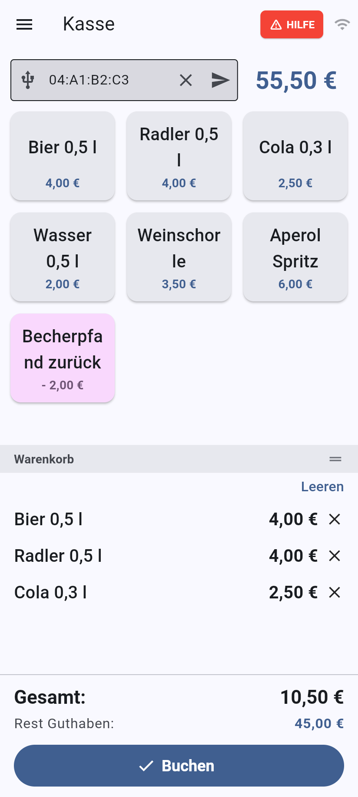

# NFC-Kasse – Kurzanleitung Standpersonal

4. Oktober 2026 · Kim Schehl

## Vor Schichtbeginn

1. Tablet oder Handy einschalten und prüfen, dass es im Kassen-WLAN ist.
2. NFC-Kasse öffnen. Steht dort die Anmeldeseite: Benutzername und Passwort eingeben, die du von der Leitung bekommen hast, und **Anmelden** tippen. Die Server-URL nicht ändern.
3. Oben rechts prüfen: Das WLAN-Symbol zeigt die Verbindung zum Server, daneben steht das Symbol des NFC-Lesers. Beide müssen aktiv sein.
4. Bluetooth-Leser einschalten und einmal mit einem Chip testen.

## Verkaufen in drei Schritten

1. **Artikel antippen.** Links die Kategorie wählen (Handy: Menü ☰ oben links), dann die Artikel-Kacheln antippen. Jedes Antippen legt ein Stück mehr in den Warenkorb. Falsch getippt? Mit **×** neben dem Artikel entfernen.
2. **Chip scannen.** Den Chip des Gastes an den Leser halten. Über dem Warenkorb erscheint das Guthaben, unten **Rest Guthaben** nach dem Kauf. Die Reihenfolge ist egal: Erst scannen, dann Artikel tippen geht genauso.
3. **Buchen tippen.** Die grüne Meldung **Buchung bestätigt** erscheint. Fertig, der nächste Gast kann kommen.

Auf dem Handy liegt der Warenkorb unter den Kacheln. Die Trennlinie lässt sich verschieben.

## Sonderfälle

### Guthaben reicht nicht

**Rest Guthaben** ist rot und **Buchen** grau. Dem Gast den Restbetrag nennen und Artikel entfernen oder ihn zur Bonkasse zum Aufladen schicken.

### Neuer Kunde

Steht über dem Guthaben **Neuer Kunde** und 0,00 €, wurde der Chip noch nie aufgeladen. Den Gast zur Bonkasse schicken. Dort wird beim ersten Aufladen automatisch der Chip-Pfand abgezogen (Zeile **Chip Pfand**).

### Artikel mit Auswahl

Manche Kacheln zeigen keinen Preis. Beim Antippen öffnet sich eine Auswahl, z. B. „mit Pommes“. Die passende Variante antippen.

### Fehlbuchung stornieren

Direkt nach einer Buchung erscheint unten **Letzte Buchung stornieren**. Antippen, Artikel prüfen, **Buchung stornieren** bestätigen. Das Geld geht zurück auf den Chip. Das geht nur in den ersten 5 Minuten. Danach die Standleitung holen.

## Wenn etwas nicht klappt

| Problem | Was tun |
| --- | --- |
| Chip wird nicht erkannt | Chip 1–2 Sekunden ruhig auf den Leser legen. Leser an? Symbol oben rechts prüfen |
| Leser-Symbol zeigt getrennt | Leser aus- und wieder einschalten, kurz warten. Hilft das nicht: Einstellungen → NFC-Lesegerät → Leser antippen |
| Oben steht „Keine Verbindung zum Server“ | WLAN des Geräts prüfen. Nicht weiter buchen, bis die Verbindung wieder steht |
| „Doppelbuchung verhindert“ | Es wurde zweimal getippt. Die erste Buchung ist durchgegangen |
| Leeres Menü ohne Kategorien | Du hast noch keine Rechte für deinen Stand. Leitung Bescheid sagen |

### Hilfe rufen

Oben rechts auf den roten Knopf **HILFE** tippen und **HILFE ANFORDERN** bestätigen. Die Notfall-Kontakte bekommen sofort eine Meldung. Ihre Antwort, z. B. „Auf dem Weg“, erscheint auf deinem Gerät. Ist alles geklärt, **Erledigt** tippen.

## Schichtende

1. In der Seitenleiste ganz unten auf deinen Namen tippen und **Abmelden**.
2. Leser ausschalten und zusammen mit dem Gerät zum Laden abgeben.

Die Abmeldung ist wichtig: Jede Buchung läuft auf deinen Namen.
