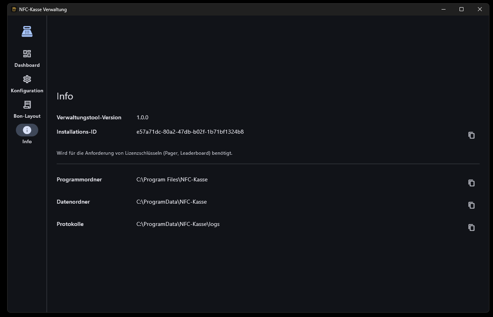
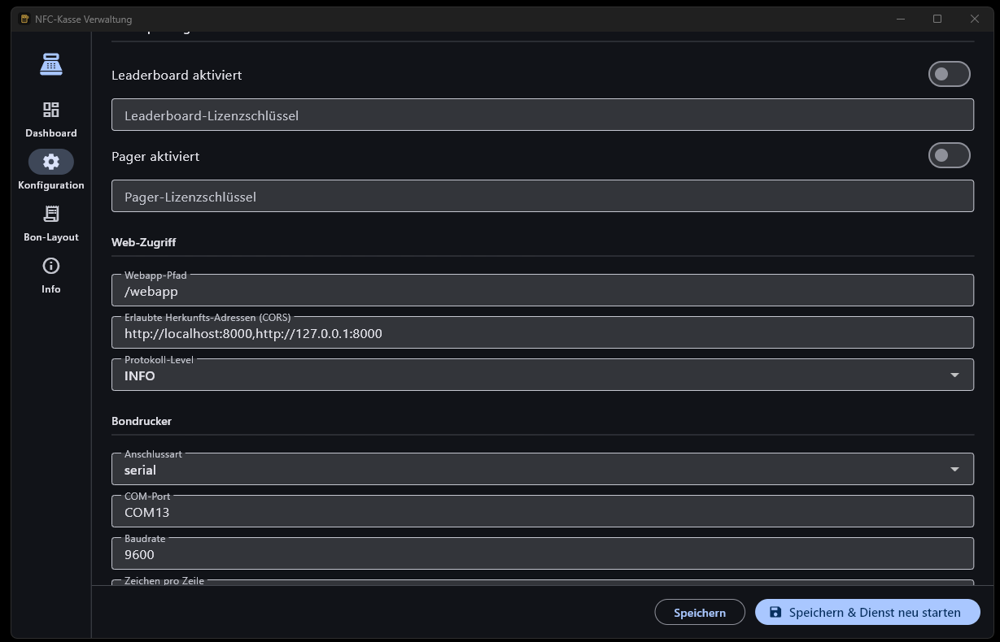
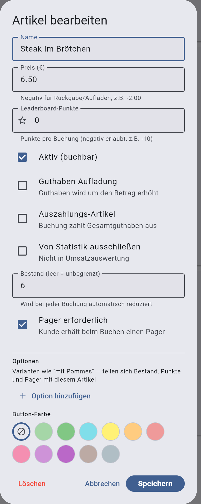
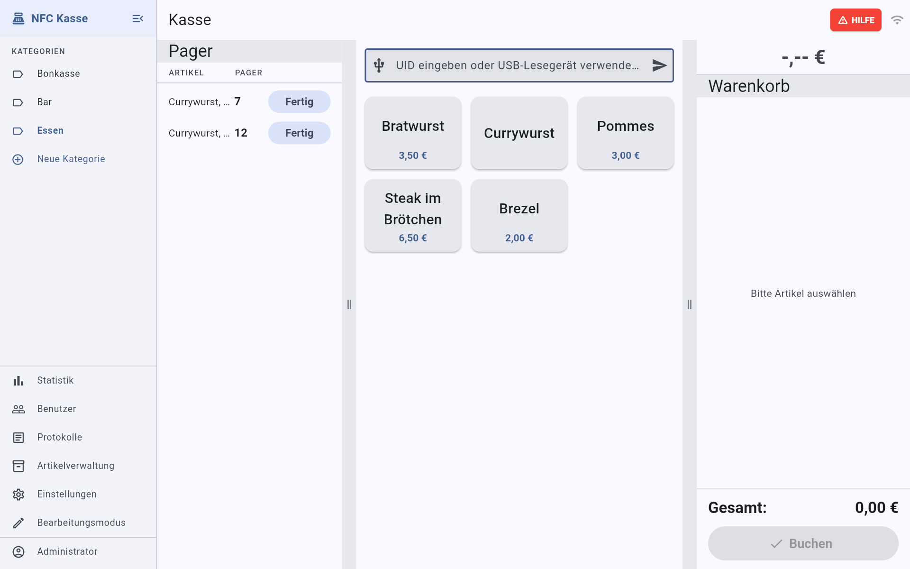
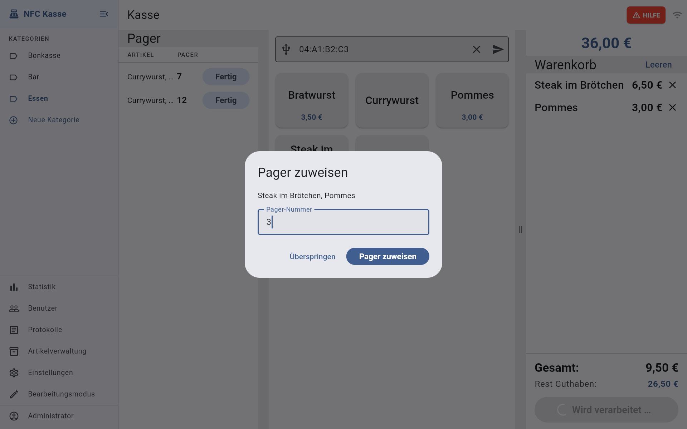
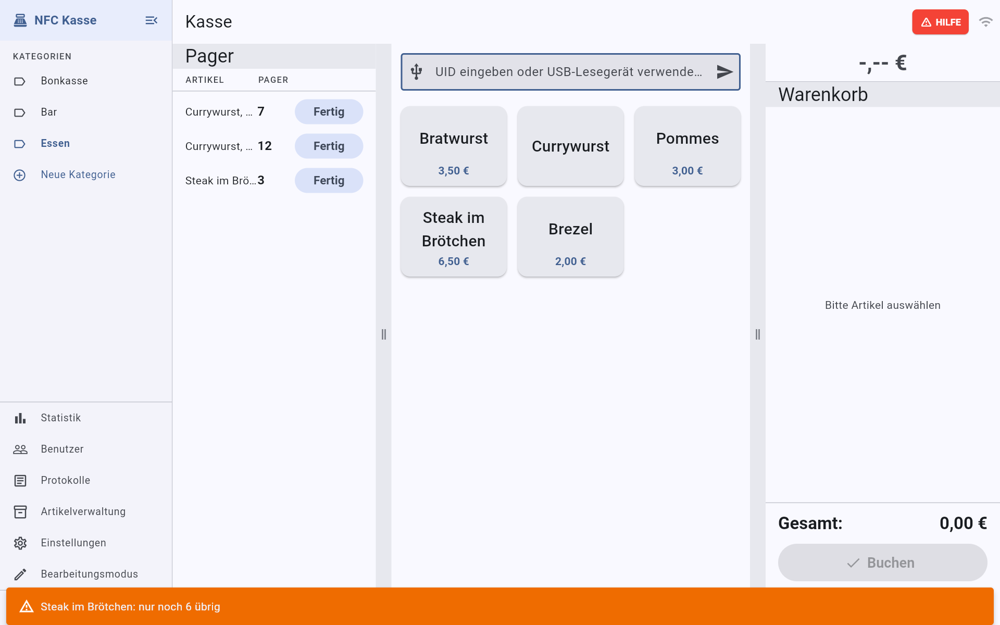
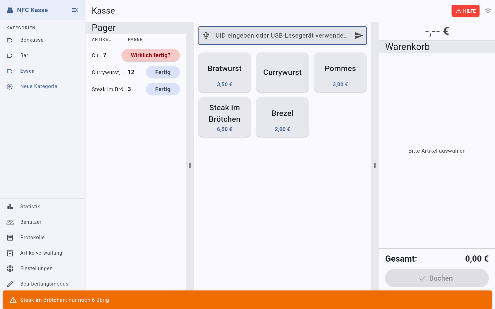
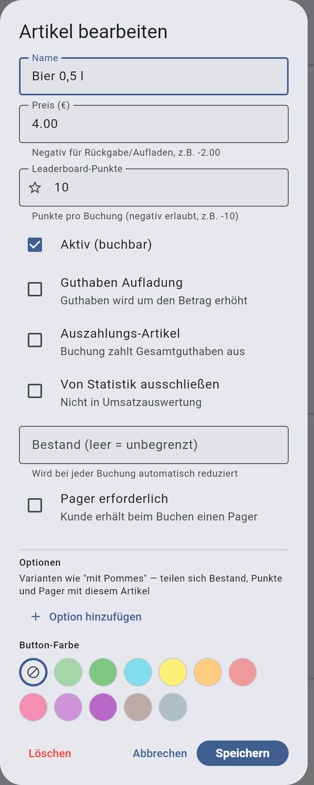
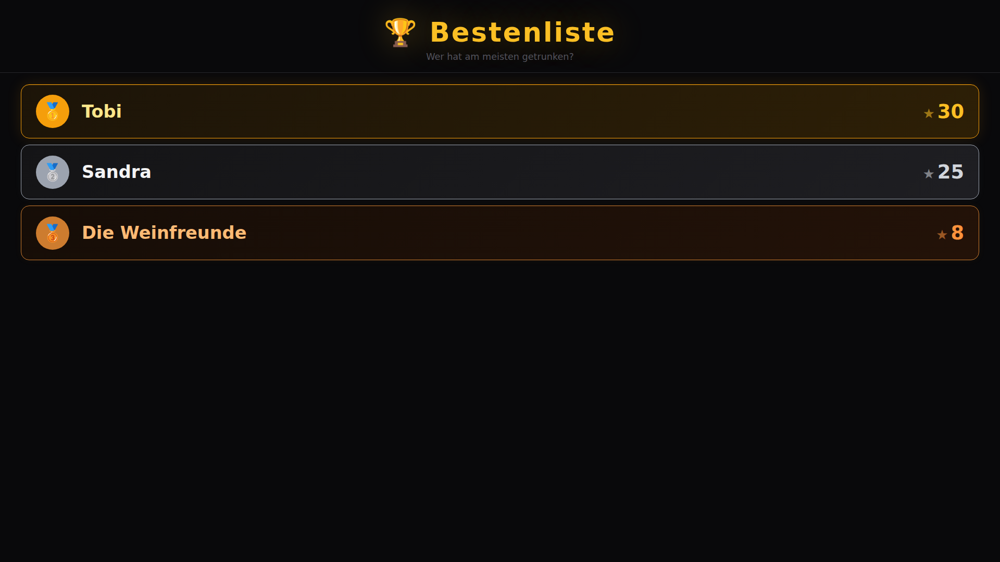
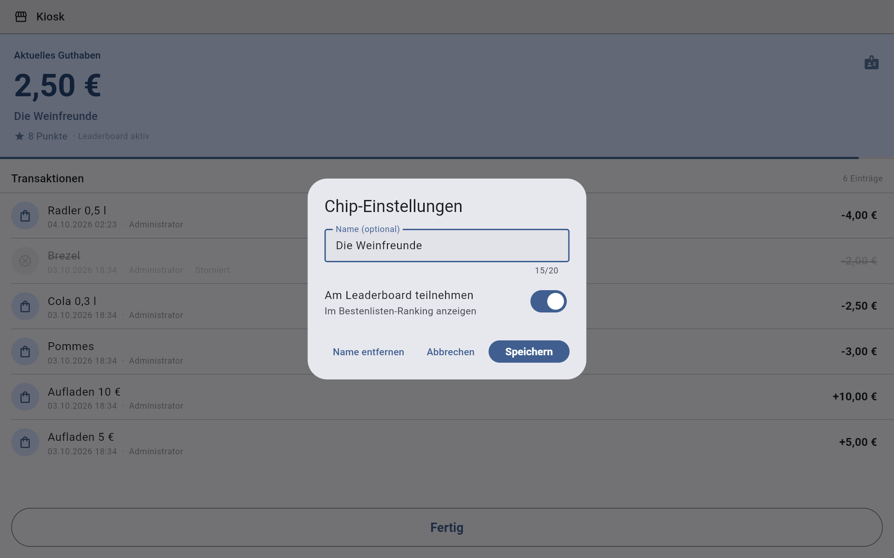

# NFC-Kasse – Zusatzfunktionen Pager und Leaderboard

4. Oktober 2026 · Kim Schehl

## 1. Freischalten

Pager und Leaderboard sind kostenpflichtige Zusatzfunktionen. Jede braucht einen eigenen Lizenzschlüssel, der nur für genau eine Installation gilt. Eine Funktion ist erst aktiv, wenn in `config.env` der Schalter auf `true` steht **und** ein gültiger Schlüssel eingetragen ist.

1. **Installations-ID heraussuchen.** Öffnen Sie die NFC-Kasse Verwaltung, Seite **Info**. Neben **Installations-ID** kopiert das Symbol ganz rechts die ID in die Zwischenablage. Alternativ steht sie in `C:\ProgramData\NFC-Kasse\config.env` in der Zeile `INSTALLATION_ID=…`.

   

2. **Lizenz anfordern.** Die Installations-ID mit der gewünschten Funktion an kontakt@nfc-kasse.de schicken, notfalls an info@nfc-kasse.de. Sie bekommen eine Zeile wie `PAGER_LICENSE_KEY=eyJ2Ij…` zurück.
3. **Eintragen.** In der Verwaltung unter **Kostenpflichtige Zusatz-Features** den Schalter **Pager aktiviert** bzw. **Leaderboard aktiviert** einschalten und den Schlüssel in das Feld **Pager-Lizenzschlüssel** bzw. **Leaderboard-Lizenzschlüssel** einfügen. Von Hand in `config.env`:

```
PAGER=true
PAGER_LICENSE_KEY=<Schlüssel>
LEADERBOARD=true
LEADERBOARD_LICENSE_KEY=<Schlüssel>
```



4. **Neu starten.** **Speichern & Dienst neu starten** klicken.
5. **Prüfen.** Alle Kassen einmal ab- und wieder anmelden. Mit Pager erscheint links auf der Kasse die Spalte **Pager**. Mit Leaderboard zeigt `http://nfc-kasse.lan:8000/leaderboard` die Bestenliste.

Bleibt die Funktion aus, passt der Schlüssel nicht zur Installations-ID oder wurde unvollständig kopiert. Das Protokoll unter `C:\ProgramData\NFC-Kasse\logs\` enthält dann die Meldung „no valid …\_LICENSE\_KEY — feature stays disabled“. Achtung: Wird `config.env` gelöscht und neu erzeugt, entsteht eine neue Installations-ID und alle Lizenzen werden ungültig.

## 2. Pager einrichten

Ob ein Gast einen Pager bekommt, legen Sie pro Artikel fest. Sinnvoll ist das für alles mit Wartezeit, zum Beispiel Flammkuchen oder Burger. Getränke, die sofort über die Theke gehen, brauchen keinen Pager.

Die Kasse merkt sich nur die Nummer des Pagers. Die Pager selbst (handelsübliche, nummerierte Gastro-Pager mit Ladestation) sind ein eigenes Gerät und nicht mit der Kasse verbunden.

1. Melden Sie sich mit einem Konto an, das Artikel bearbeiten darf.
2. Öffnen Sie im Menü die **Artikelverwaltung**.
3. Tippen Sie auf den Artikel, oder legen Sie mit **+** einen neuen an.
4. Setzen Sie den Haken **Pager erforderlich** („Kunde erhält beim Buchen einen Pager“).
5. Tippen Sie auf **Speichern**.



Gut zu wissen:

- Den Haken sehen Sie nur, wenn die Pager-Funktion freigeschaltet ist (Abschnitt 1).
- Optionen eines Artikels, etwa „mit Pommes“, übernehmen die Einstellung des Hauptartikels. Sie müssen den Haken dort nicht extra setzen.
- Bei Aufladungs- und Auszahlungs-Artikeln gibt es keinen Pager. Die Kasse speichert den Haken dort nicht.

## 3. Pager im Betrieb

Ist die Pager-Funktion aktiv, zeigt die Kasse auf Tablet und PC links neben den Artikeln die Spalte **Pager**. Dort stehen die offenen Bestellungen, die Sie selbst gebucht haben, jeweils mit Artikel und Pager-Nummer. Die Breite der Spalte lässt sich am Griff ‖ rechts davon verschieben.



### Bestellung mit Pager buchen

1. Chip scannen und Artikel antippen wie gewohnt.
2. Auf **Buchen** tippen. Ist ein Artikel mit Pager im Warenkorb, öffnet sich das Fenster **Pager zuweisen**. Oben steht, wofür der Pager ist.
3. Die Nummer des Pagers eingeben, den Sie dem Gast geben.
4. Auf **Pager zuweisen** tippen. Die Buchung läuft, der Pager steht danach in Ihrer Liste.

Ist die Nummer bei Ihnen noch offen, erscheint unter dem Feld der Hinweis „Pager Nr. 7 ist bereits offen“. Buchen können Sie trotzdem. Prüfen Sie aber, ob Sie sich vertippt haben.

Will der Gast keinen Pager, etwa weil er gleich wartet, tippen Sie auf **Überspringen**. Gebucht wird dann ohne Pager.





### Bestellung fertig melden

1. Ist das Essen fertig, lesen Sie die Nummer in der Pagerliste ab, tippen sie an der Pager-Station ein und lösen den Pager aus. Die Kasse ist nicht mit der Pager-Station verbunden, das machen Sie von Hand.
2. Holt der Gast ab, tippen Sie in der Pagerliste neben dem Eintrag auf **Fertig**.
3. Der Knopf wechselt auf **Wirklich fertig?**. Tippen Sie innerhalb von 3 Sekunden noch einmal. Danach verschwindet der Eintrag.

Das doppelte Tippen verhindert, dass ein Eintrag aus Versehen verschwindet. Tippen Sie nicht ein zweites Mal, springt der Knopf von selbst zurück.



### Gut zu wissen

- Jeder sieht nur die eigenen Pager. Arbeiten zwei Personen an einer Theke mit getrennten Konten, hat jede ihre eigene Liste. Teilen Sie sich eine Liste, melden Sie sich mit demselben Konto an.
- Die Liste aktualisiert sich alle 10 Sekunden von selbst, nach einer eigenen Buchung sofort.
- Am Handy gibt es keine Pagerliste, nur das Fenster zum Zuweisen. Für Theken mit Pagern nehmen Sie ein Tablet.
- Auszahlungen fragen nie nach einem Pager.
- Eine Stornierung entfernt den Pager nicht aus der Liste. Melden Sie ihn danach mit **Fertig** ab.
- **Neues Event** in der Statistik schließt alle offenen Pager.

## 4. Leaderboard einrichten

Das Leaderboard ist eine Bestenliste für Gäste. Jeder Artikel kann Punkte bringen, zum Beispiel 1 Punkt pro Bier. Auf einem Fernseher läuft dann live, wer die meisten Punkte hat.

### Punkte pro Artikel festlegen

1. Melden Sie sich mit einem Konto an, das Artikel bearbeiten darf.
2. Öffnen Sie im Menü die **Artikelverwaltung** und tippen Sie auf den Artikel.
3. Tragen Sie im Feld **Leaderboard-Punkte** ein, wie viele Punkte eine Buchung bringt. Erlaubt sind ganze Zahlen, auch negative: „-10“ zieht 10 Punkte ab, etwa für ein Wasser beim Trinkspiel.
4. Tippen Sie auf **Speichern**.



Artikel mit 0 Punkten zählen nicht. Optionen eines Artikels, etwa „Weinschorle süß“, bringen dieselben Punkte wie der Hauptartikel.

### Bestenliste auf dem Fernseher zeigen

1. Schließen Sie einen Fernseher oder Monitor an einen PC, Laptop oder Mini-PC im Kassen-WLAN an.
2. Öffnen Sie im Browser die Adresse **http://nfc-kasse.lan:8000/leaderboard**. Ist die Namensauflösung nicht eingerichtet, nehmen Sie **http://192.168.1.2:8000/leaderboard**.
3. Drücken Sie **F11** für den Vollbildmodus.

Die Seite braucht keine Anmeldung. Sie zeigt die zehn Chips mit den meisten Punkten und aktualisiert sich von selbst, sobald sich an den ersten zehn Plätzen etwas ändert.



## 5. Leaderboard im Betrieb

Auf der Bestenliste erscheint nur, wer mitmachen will. Das entscheidet der Gast selbst am **Kiosk**, dem Selbstbedienungs-Terminal, an dem Gäste ihr Guthaben ansehen.

### Kiosk einrichten

1. Legen Sie in der Benutzerverwaltung ein eigenes Konto an, zum Beispiel „kiosk“.
2. Geben Sie ihm nur die Berechtigung **Kundenterminal → Kiosk-Modus**.
3. Melden Sie sich auf einem Tablet mit diesem Konto an. Die App zeigt dann nur noch den Kiosk.
4. Stellen Sie das Tablet mit einem NFC-Leser für die Gäste auf.

### So nimmt ein Gast teil

1. Der Gast hält seinen Chip an den Leser. Der Kiosk zeigt Guthaben, Punkte und die letzten Buchungen.
2. Er tippt oben rechts auf das Namensschild-Symbol. Das Fenster **Chip-Einstellungen** öffnet sich.
3. Er trägt bei **Name (optional)** einen Namen ein, höchstens 20 Zeichen.
4. Er schaltet **Am Leaderboard teilnehmen** ein.
5. Er tippt auf **Speichern** und dann unten auf **Fertig**.



Unter dem Guthaben steht danach „Leaderboard aktiv“. Mit **Name entfernen** löscht der Gast seinen Namen wieder, mit dem Schalter meldet er sich ab.

### Gut zu wissen

- Punkte sammelt jeder Chip von Anfang an, auch ohne Teilnahme. Wer sich später anmeldet, steht sofort mit allen bisherigen Punkten auf der Liste.
- Ohne Namen steht der Chip als „Anonym“ auf der Liste.
- Wird eine Buchung storniert, werden ihre Punkte wieder abgezogen.
- Bei Punktgleichstand steht der Chip vorne, der zuerst ausgegeben wurde.
- **Neues Event** in der Statistik setzt die Punkte und Namen nicht zurück. Sie bleiben am Chip, bis der Chip neu vergeben wird.
- Achten Sie auf die Namen: Was ein Gast eintippt, steht groß auf dem Fernseher. Behalten Sie die Liste im Blick und entfernen Sie unpassende Namen am Kiosk mit dem Chip des Gastes.
